# ネットワークといえば...?

# <!-- fit --> 「ネットワーク」と聞いて何を思い浮かべますか?

---

# IPアドレスとは

IPアドレスとは、

> ネットワーク上の機器に割り当てられる**インターネット上の住所**のような存在で、ネットワーク上でデータを送受信する際、通信相手を指定するために使われているもの

である。

IPアドレス (IPv4)は0から255の数字を4つ組み合わせた形式で表現される
eg: 185.199.108.153 (GitHub)

---

# IPアドレスとは

右の図のように、インターネットに接続するユーザーはそれぞれのIPアドレス (住所)を持つことになる

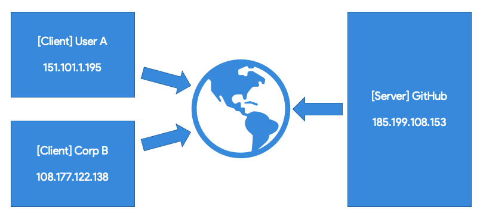

---

# [Activity] 自分のパソコンに割り当てられているIPアドレスを調べてみよう

みなさんのパソコンには2種類のIPアドレスが割り当てられています。

> 1. 自分のグローバルIPを調べてみる
> [whatismyipaddress.com](https://whatismyipaddress.com/)を使って、IPアドレス (IPv4アドレス)を調べてみよう
>
> 1. 自分のプライベートIPを調べてみる
> Windowsの場合は`ipconfig`コマンド、macOSの場合は`ipconfig getifaddr en0`コマンド (WiFi環境)を使って、IPアドレス (IPv4アドレス)を調べてみよう

---

# [補足] WindowsでのプライベートIPの調べ方

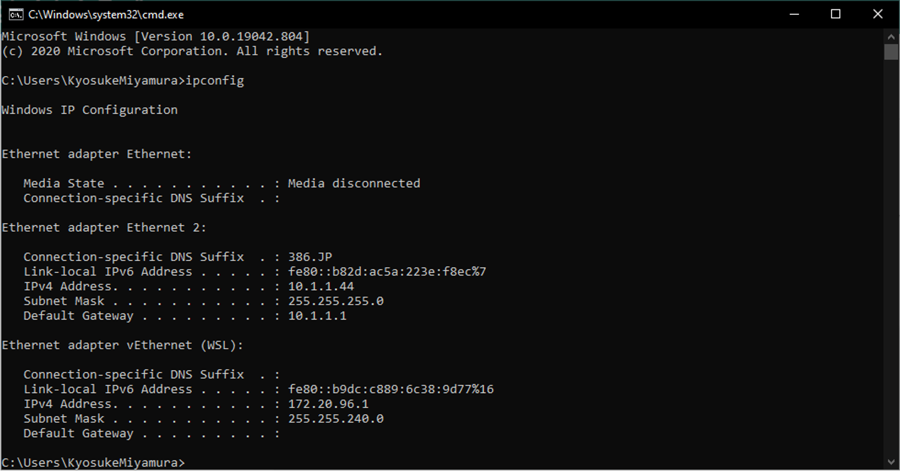

---

# [補足] macOSでのプライベートIPの調べ方

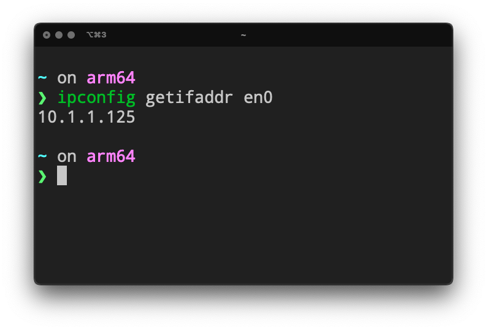

---

# グローバルIPとプライベートIP

# <!-- fit --> グローバルIPとプライベートIPって何が違うんだろう?

---

# グローバルIPとプライベートIP

> * **グローバルIP (Global IP)**: インターネットの世界でのIP (土地の住所)
> * **プライベートIP (Private IP)**: 家や企業の中だけのIP (マンションの部屋番号)

---

# グローバルIPとプライベートIP

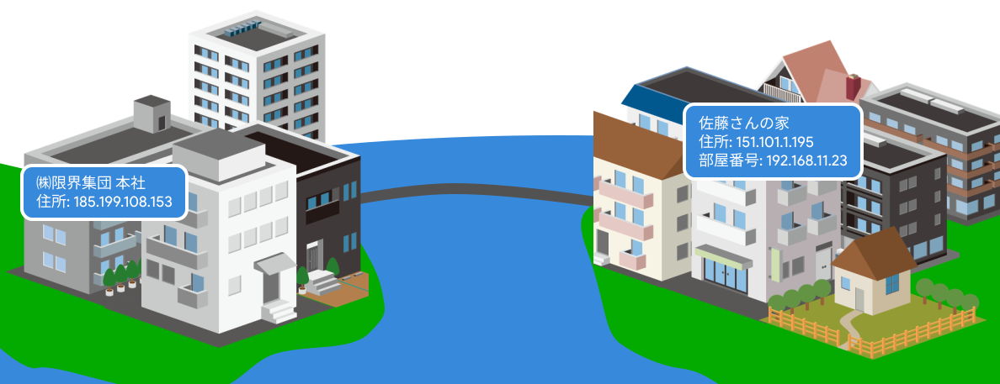

---

# [余談] グローバルIPとプライベートIP: プライベートIPの範囲

プライベートIPは、グローバルIPと同じように0から255の数字を4つ組み合わせた形式で表現されるが、以下の数字の範囲が特別にプライベートIPとして割当てられている。

> * **Class A (大規模)**: `10.0.0.0` - `10.255.255.255` (`10.0.0.0/8`) (16,777,214台)
> * **Class B (中規模)**: `172.16.0.0` – `172.31.255.255` (`172.16.0.0/12`) (65,534台)
> * **Class C (小規模)**: `192.168.0.0` - `192.168.255.255` (`192.168.0.0/16`) (254台)

---

# [余談] グローバルIPとプライベートIP: プライベートIPの範囲

> eg: `192.30.252.153` (GitHub Pages)はパブリックIP

Class Aは企業内のネットワークで使われることが多く、Class Cは家庭内のネットワークで使われることが多い。

このIPアドレスの範囲はCIDRという表記法を用い、アドレスブロックとして、ネットワークを定義することができる。ここでネットワークをまたぐことになる場合はルーティングを行う必要がある。 (CIDR記法の例: `10.0.0.0/8`という表記の場合、`10.0.0.0` - `10.255.255.255`の範囲のIPアドレスを示すことになる)

---

# グローバルIPとプライベートIP

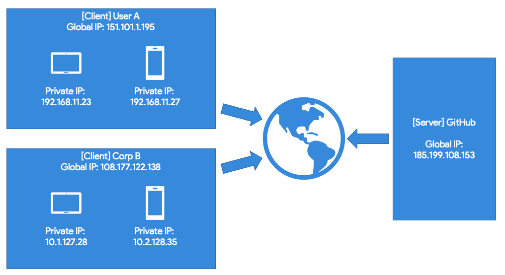

---

# グローバルIPとプライベートIPの使い分け

基本的にインターネット上で通信する場合は**グローバルIP**を使って通信を行う。

> では、なぜプライベートIPが必要なのか?

---

# グローバルIPの枯渇問題

2000年代から、急激にコンピューターをはじめとするインターネットに接続する機器が増加。

世界には約43億個、それぞれの機器に割り当てることのできるIPアドレス (IPv4)があるが、もう既にかなりの数が使われており、枯渇している。

グローバルIPアドレスは、IANA（Internet Assigned Numbers Authority）が管理しており、APNIC（Asia Pacific Network Information Center）やJPNIC（日本ネットワークインフォメーションセンター）など各国のNICが企業や団体などへの割り当て作業を行っている。

---

# グローバルIPの枯渇問題

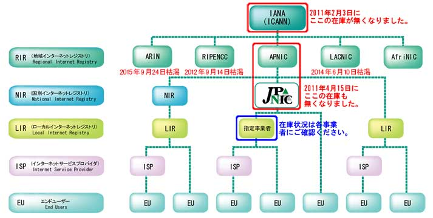[^1]

[^1]: https://www.nic.ad.jp/ja/ip/ipv4pool/

---

# グローバルIPの枯渇問題の解決方法

> 🤔: 別にすべての端末がインターネット上からアクセスできるようにする必要はないよね?

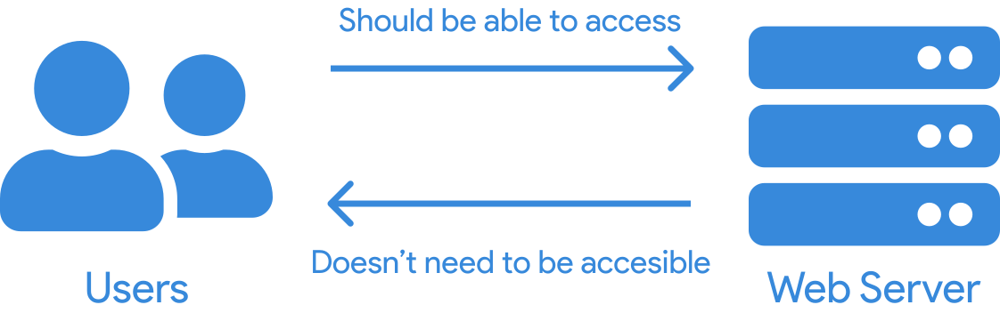

→ じゃあ、クライアント機まとめて1つのグローバルIPを持たせるようにしよう!

---

# グローバルIPの枯渇問題の解決方法

現在のほとんどのエンドユーザーのネットワーク環境は、グローバルIPを複数の端末で共有する形が取られている。

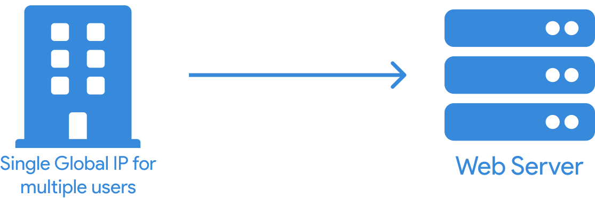

---

# グローバルIPとプライベートIP

インターネット上にサーバーを建てて、世界中のみんなからアクセスしてもらえるようにするには、**グローバルIP**を使用する。

マンションの部屋番号だけ分かっていてもそこの住所にはたどり着くことってできないよね?

→ プライベートIPしかわからない状況では広いインターネットの世界の中のどの場所かを特定するのは不可能

---

# グローバルIPとプライベートIP

Webサイトにアクセスする場合などは**グローバルIP (ここで言う住所)** さえ分かればOK

---

# ルーティングとは

ルーティング (ネットワークルーティング)とは、

> 複数のネットワーク間のパス (経路)を選択するプロセス

である。

ちなみにNTT東日本の人は「ルーチング」と言うらしい。

---

# そもそも「ルーター」とは

家にある「ルーター」は「ルーター」ではないかも...?

---

# そもそも「ルーター」とは

一般家庭向けに売られている「ルーター」は**ルーターとWiFiアクセスポイントが合わさっている**ものである。

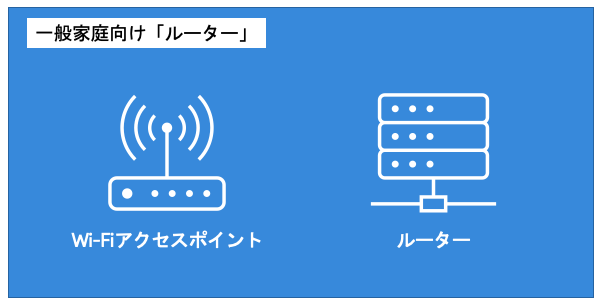

> では、「ルーター」って本来何者なの?

---

# ルーティング・ルーターとは

ルーティング (ネットワークルーティング)とは、

> 複数のネットワーク間のパス (経路)を選択するプロセス

である。

道路の交差点や、その交差点の交通整理をする警察官のような位置付け

---

# ルーティング・ルーターとは

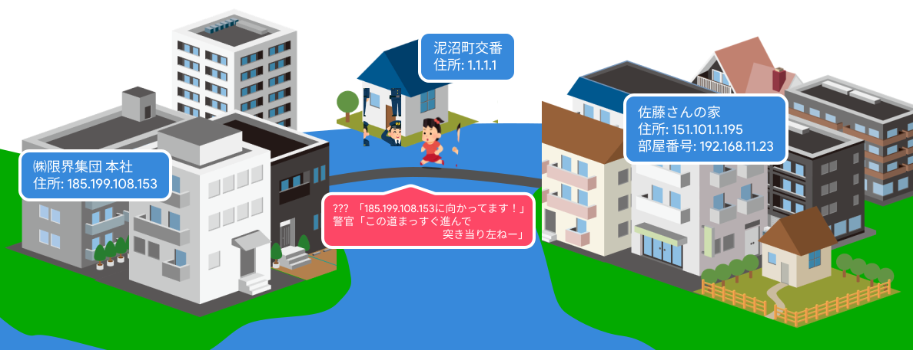

---

# ルーティング・ルーターとは

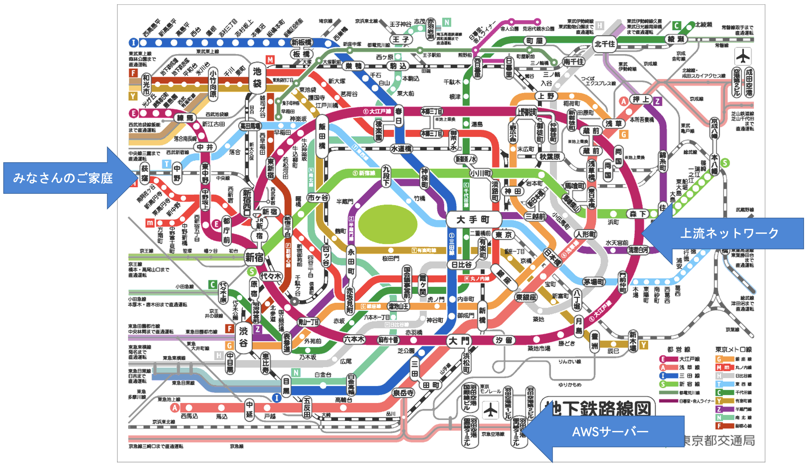

---

# [余談] ルーティングの鉄則

> サーバーからクライアントまでの距離は近ければ近いほどいい

ネットワークとかクラウドとかの単語を聞くだけだとあまり想像できないが、実際の通信は海底ケーブルや地上のケーブルなど、実際の物理的なケーブルを通ってきているので、道路と同じように、物理的な距離が**遠ければ遠くなるほど、到達時間が長く**なる (遅延が大きくなる)

---

# [余談] ルーティングの鉄則

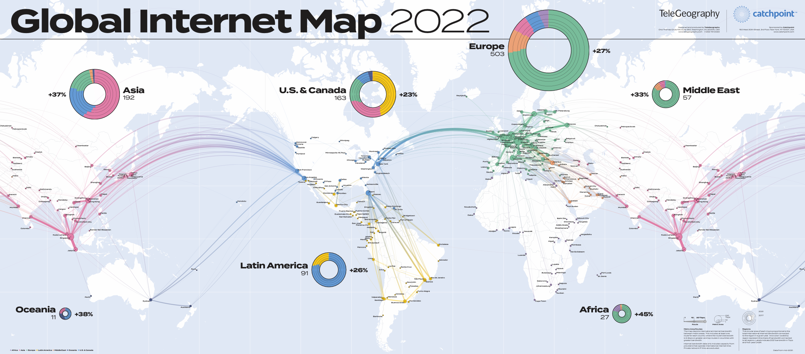

---

# [余談] ルーティングの鉄則

> サーバーからクライアントまでの距離は近ければ近いほどいい

また、通信の過程のどこかに通信幅が狭い経路があった場合、全体の通信が遅くなってしまう。 (高速道路と下道を比較したときに下道の方が到達するまでの時間がかかりますよね?)

---

# [余談] 5Gの「高速・大容量・低遅延」ってほんとにそう?

世の中、「5G」と騒がれているが、結局途中の経路のどこかが遅い場合、いくら5Gの通信であっても遅くなってしまうため、インターネットのインフラ全体が高速化しない限り高速・大容量・低遅延なネットワーク環境はできない。

ただ、事実として、5Gになったことによって、4Gよりは光回線のような有線接続の体験に近くなったことは事実。

---

# [Activity] ルーティングを可視化してみる

ルーティングの様子は`tracert`または`traceroute`コマンドを使うことで可視化できる

> Windows `tracert 386.jp`
> macOS `traceroute 386.jp`

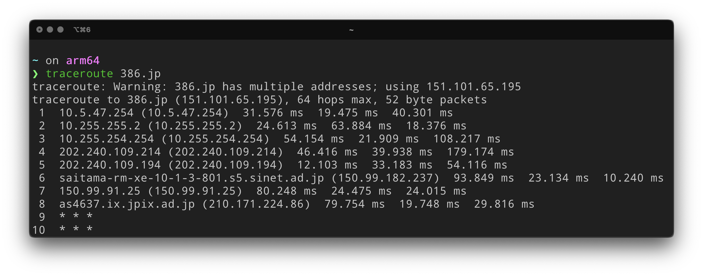

---

# ドメインの必要性

近所のスーパーの住所、覚えてますか?

> 🤔 スーパー〇〇としか覚えてないなぁー、、

---

# ドメインの必要性

インターネットの世界でも同じように、IPアドレス (インターネット上の住所)を覚えることは難しい

> 🤔 Googleで検索したいんだけど、GoogleのIPアドレスは`108.177.122.113`だからー、、、

とはなりませんよね...?

---

# ドメインとは

ドメインとは、

> インターネット上に存在するコンピューターやネットワークを識別するための名前

である。

IPアドレスを、人間にとって可読性を高めたものがドメイン

eg: `google.com`, `amazon.co.jp`, `musashino-u.ac.jp`, `386.jp`

---

# ドメインとIPアドレスを変換する

現実の世界では、電話帳のようなもので変換してますよね?

> **スーパー〇〇**: 東京都江東区〇〇

現実と同じように、インターネットの世界でも名前と住所、つまりドメインとIPアドレスを変換している

→ ドメインとIPアドレスを変換する役割を担っているのがDNS

---

# ドメインとIPアドレスを変換する

DNS (Domain Name System)とは、

> ドメイン名とIPアドレスの対応付けや、 メールの宛先ホストを指示するためのシステム

である。

---

# ドメインとIPアドレスを変換する

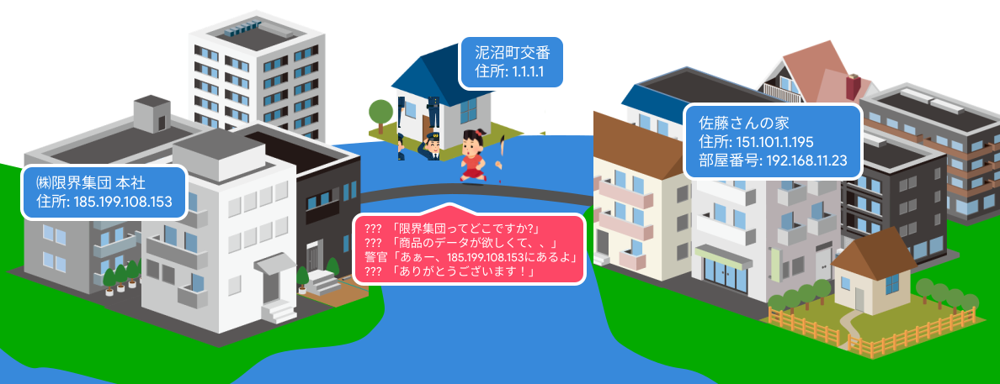

---

# ドメインとIPアドレスを変換する

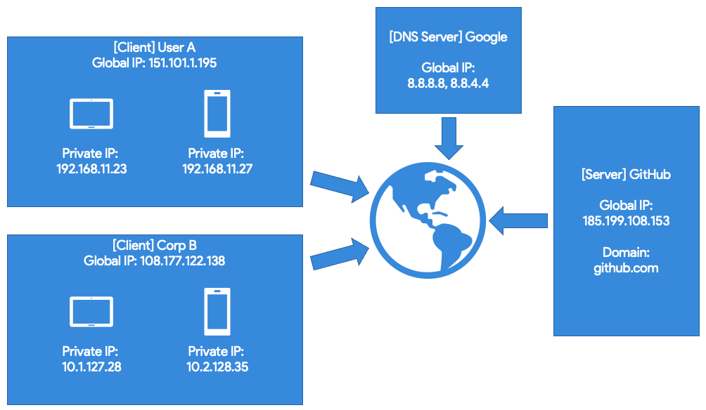

---

# [Activity] DNSの役割を見てみよう

`nslookup`または`dig`コマンドを使うことでDNSレコードを参照することができる

> Windows: `nslookup -type=any 386.jp`
> macOS: `dig -t ANY 386.jp`

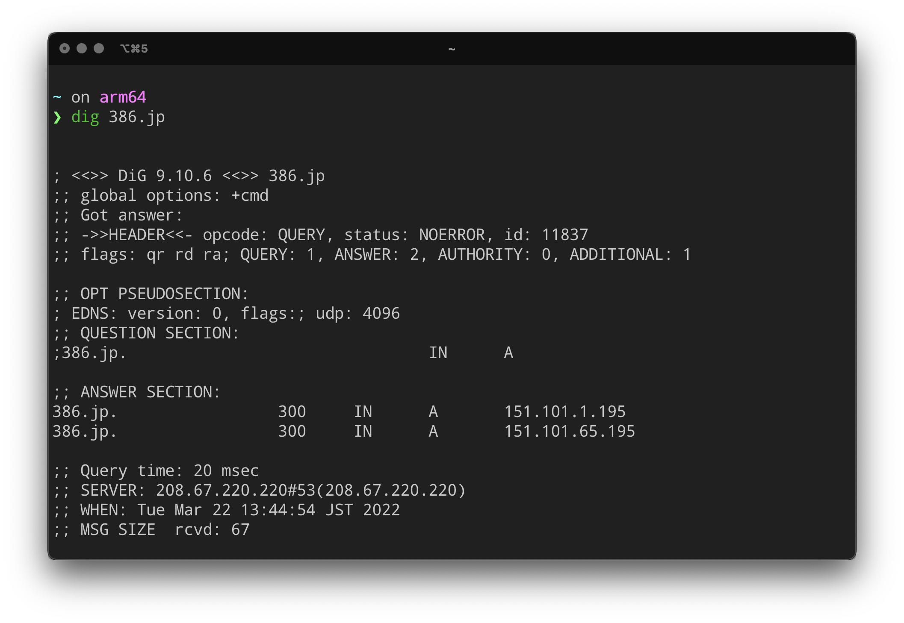

---

# DNSレコードとは

同じドメインでも、様々な通信を行うことができる

> eg: `386.jp`というドメインに対する通信では、Webサイトを表示することもできるし、メールのやり取りをすることもできる

---

# DNSレコードとは

|レコード種別|意味|DNS定義ファイルなどでの定義例|
|-|-|-|
|A|ホストのIPアドレス|www IN A 192.168.1.10|
|AAAA|ホストのIPv6アドレス|www IN AAAA fd00::1|
|CNAME|ドメインのエイリアス (別名)|www IN CNAME backup1.example.com.|
|MX|ドメインのメール・サーバ名|(ドメイン名) IN MX 10 mail.example.com.|
|TXT|ホストへのテキスト情報|www IN TXT "MS=ms00000000"|

DNSレコードの種類は、ここで扱っていないものもあります。また、`CNAME`レコードが`HTTPS`レコードに置き換わるなど、今後変化していく可能性のあるレコードもあります。

---

# ポート番号とは

ポート番号とは、

> コンピュータが通信に使用するプログラムを識別するための番号

である。

土地の住所: グローバルIP, マンションの部屋番号: プライベートIPだとしたら、ポート番号はその部屋のどの住人かを指している

---

# ポート番号とは

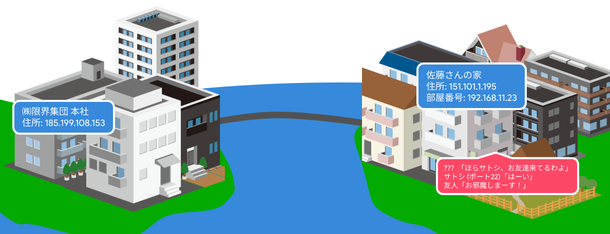

---

# 有名なポート番号

|アプリケーション|ポート番号|
|-|-|
|Webサーバー (HTTP)|80|
|Webサーバー (HTTPS)|443|
|SSH|22|
|PostgreSQL|5432|
|Minecraft|19132|
|DNSサーバー|53|

---

# ポート番号の種類

ポート番号には3種類ある

> * **WELL KNOWN PORT NUMBERS**
> IANAが管理している使用目的が定められたポート番号 (0 - 1023)
>
> * **REGISTERED PORT NUMBERS**
> IANAに登録されている番号 (企業などが登録) (1024 - 49151)
>
> * **DYNAMIC AND/OR PRIVATE PORTS**
> 誰でも自由に使える番号 (49152 - 65535)

---

# IPアドレス, ドメインとポート番号

IPアドレスやドメインとポート番号を組み合わせて書くときの書き方

> **IPアドレス**: `192.168.11.23:5000`
> **ドメイン**: `www.386.jp:443`

---

# TCPとUDP

通信はIPアドレス、ポート番号で用途や通信先を識別することができるようになっているが、その他にも用途に合わせて通信の種類が選択できる

> * **TCP**
>   * コネクション型プロトコル → 信頼性が高い
>   * ウィンドウ制御, 再送制御, 輻輳 (ふくそう)制御を行う
>   * **用途**: 使いやすい・信頼性が高いので多くのアプリケーションで使用されている
> * **UDP**
>   * コネクションレス型プロトコル→信頼性を確保する仕組みがない
>   * 処理が簡単で遅延が少ない
>   * **用途**: 制御用の短いデータや、遅延がシビアな音声・動画データなど

---

# コネクション型プロトコル (TCPなど)

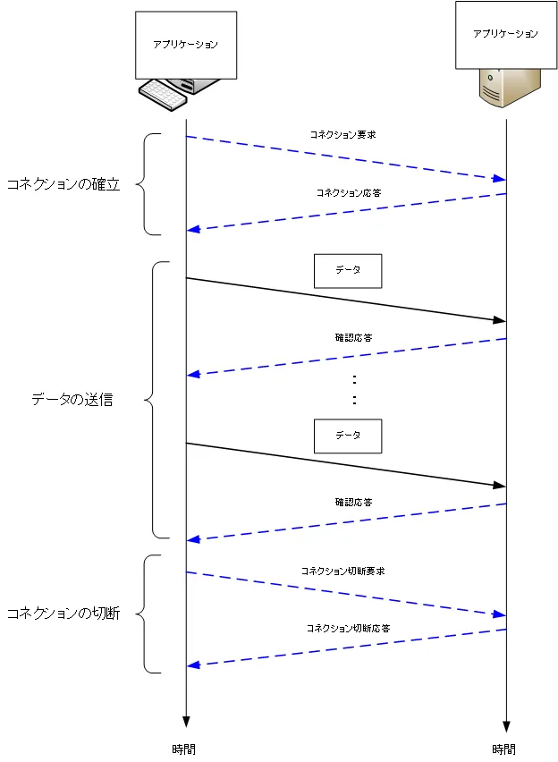

---

# コネクションレス型プロトコル (UDPなど)

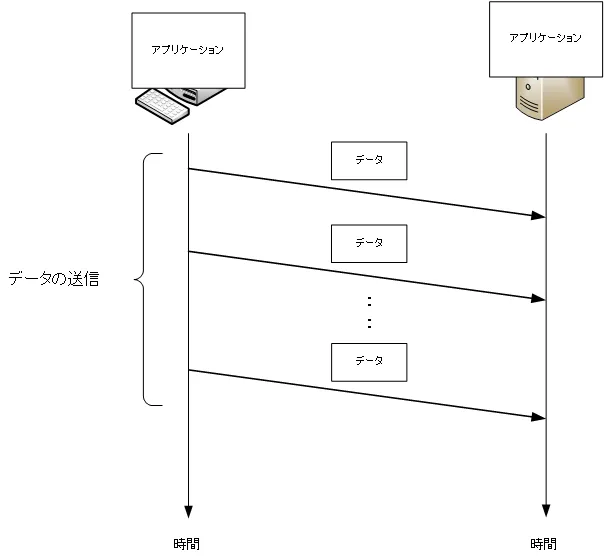

---

# 有名なポート番号

|アプリケーション|ポート番号|TCP/UDP|
|-|-|-|
|Webサーバー (HTTP)|80|TCP|
|Webサーバー (HTTPS)|443|TCP|
|SSH|22|TCP|
|PostgreSQL|5432|TCP|
|Minecraft|19132|**UDP**|
|DNSサーバー|53|**UDP**|

---

# TCPとUDP

**TCP**

> ---7/23(月)---
> 0:11 A子『ねえ、まだ起きてる？』
> 0:11 B男『ん？起きてるよー』
> 0:12 A子『よかった！まだ起きてるんだ！今日さー、〜〜〜』(通信開始)

---

# TCPとUDP

**UDP**

> ---7/23(月)---
> 17:45 B男『これから帰ります』
> ---7/24(火)---
> 19:23 B男『これから帰ります』
> ---7/25(水)---
> 17:35 B男『これから帰ります』
> 17:45 A子『卵買ってきて』
> ---7/26(木)---
> 20:56 B男『これから帰ります』

---

# TCPとUDPの使い分け

**TCP**
> * Web (HTTP, HTTPS)
> * メール (POP)
> * ファイル転送 (FTP)

**UDP**
> * Minecraft
> * Parsec (リモートソフト)
> * DNS
> * NTP (時刻合わせ)
> * OSC (音楽機材などで使われる)

---

# おさらい

> * IPアドレスという数字の組み合わせで表現されるインターネット上の住所がある (グローバルIP)
> * プライベートIPは基本的に同一ローカルネットワーク内だけのもの
> * IPアドレスは人間が覚えることは難しいから、ドメインを使って覚えやすくする
> * ルーティングといい、多くの通信の経路の提示などをしてくれる (ルーター)
> * そのドメインとIPアドレスを紐付けるDNSという仕組みがある
> * ポート番号という、どのアプリに対して通信をしているのか識別するための番号がある (その中でもTCPとUDPという通信規格があり、ほとんどはTCP)

---

# おさらい

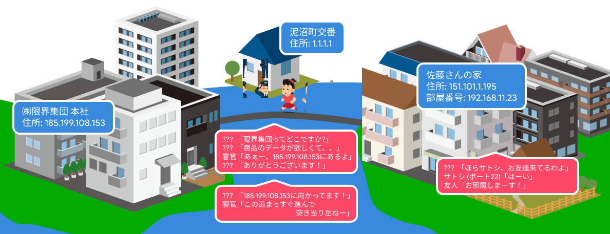