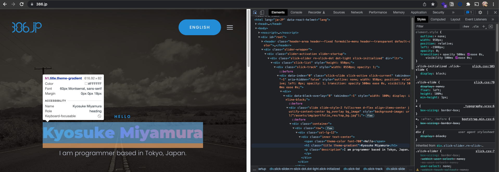

# Webといえば...?

##### Web, Webサイト, Webアプリ...

---

# Webとは

> World Wide Webの略

一番最初のWebサイト (1989年 -)では、学術論文・文書の電子化を目的としていた

> 🤔 インターネットの始まりが軍事目的だったのと同じで、もともと民間人が使うような用途からは始まってないんですね

よく、WebサイトのURLが`www.386.jp`など、`www`で始まるものが多いのは、昔は「これはホームページですよー」とそのドメインの機能を表すために`www`と付けていたから。別に必ず付けなければいけないものでもないので、現在では、その傾向は薄れている。

---

# Webサイトの構成要素

Webサイトは主にHTML, CSSで構成されている

* **HTML**: 文書の内容
    掲載コンテンツの定義や、文書の大まかな配置を行っている

* **CSS**: 文書の装飾
    コンテンツに対する詳細な装飾

---

# [Activity] Inspectツールを使ってWebサイトを見てみよう

サイトのページ内で右クリックし、`Inspect`をクリック


---

# [Activity] Inspectツールを使ってWebサイトを見てみよう

Webサイトの中身 (HTMLやCSS)を覗くことができる。



---

# [Activity] Inspectツールを使ってWebサイトを見てみよう

サイトの要素を編集することもできる


---

# HTML, CSS以外のツール

* JavaScript
> 動的にコンテンツを更新したりするのに用いられるプログラミング言語 (HTMLやCSSだけでは動的なコンテンツを生成するのは難しい)

* Flash
> 同じく動的にコンテンツを更新したりするのに用いられる。Flashアニメーションなどで流行ったが、セキュリティなどの問題もあり、サポートが終了。

---

# HTML, CSS以外のツール

* PHP
> サーバー側で動作させる言語 (JavaScriptやFlashはクライアントサイドで動作させる)。WordPress (ブログサービス)なんかが有名。

* Python
> 同じくサーバー側で動作させる言語。Djangoのように、PythonでもWebサーバーを建てて動的にコンテンツを生成することができる。

PHPやPythonのようなサーバーサイド言語や、PostgreSQLやMariaDB、MySQLなどのデータベースを用いたWebアプリのことをLAMPstackと呼ばれることが多い。 (ポートフォリオ概論で詳しくこの辺りを説明する予定)

---

# Webサイトの昔と今

初期は、HTMLやCSSを用いて、動的にコンテンツの変わらない (静的な)Webサイトが多かったが、その後、JavaScriptやFlash、更にはPHPなどを用いた動的なWebサイトが多くなってきた。

##### が、その流れは変わってきている。

---

# Webサイトの昔と今

##### スマートフォンの登場によって、APIという考え方が浸透してきている

---

# APIとは

API (Application Programming Interface)とは、

> (厳格な定義はないが) 広義にはHTTPプロトコルを用いてネットワーク越しに呼び出すアプリケーション間、システム間のインターフェースのこと

である。

---

# APIの必要性

今までは、何か情報を手軽に公開したい場合、Webサイトを制作してそこに情報を掲載する形がよく取られていたが、スマートフォンの登場によって、スマホアプリとWebサイトで同じ情報を公開したい、という需要が増えた。

---

# 身近なAPIの例: Slack API

Slackでは、様々なAPIエンドポイントが用意されており、Slackアプリ上でできることのほぼすべてをAPIを使ってもできるようになっている。

> eg: メッセージの送信、チャンネルの作成、リアクションをつける、など

---

# 最近のアプリケーションのあり方

最近のアプリケーションは、フロントエンドとバックエンドを分離して開発を行い、特にバックエンドはAPIサーバーのみを用意するスタイルが主流になっている。

---

# APIの動き

人間の対話と似ている。例えば飲み物が欲しいときは:


---

# APIの動き

APIも「〇〇が欲しいです」、「〇〇のデータをアップデートしておいてください」など、やり取りするものがデータに変わるだけ。


---

# APIの動き

APIも「〇〇が欲しいです」、「〇〇のデータをアップデートしておいてください」など、やり取りするものがデータに変わるだけ。


---

# HTTPメソッド

APIで何かデータを取得したり、更新したりする場合、`GET`, `POST`, `PATCH`, `DELETE`のいずれかを使うことになる (この他にも種類はありますが、主に使うのはこの4つ)。これをHTTPメソッドという。

> * **GET**: なにか既存のデータを**取得**する場合に用いる
> * **POST**: なにかデータを**新規に追加**する場合に用いる
> * **PATCH**: なにか既存のデータを**アップデート**する場合に用いる
> * **DELETE**: なにか既存のデータを**削除**する場合に用いる

`PUT`のように、新規作成とアップデートを兼ねているものもあるが、データベース操作の基本である`CREATE / INSERT`, `READ / SELECT`, `UPDATE`, `DELETE` (略して`CRUD`)と対応しているために、この`GET`, `POST`, `PATCH`, `DELETE`の4つが使われることが多い。

---

# JSONとは

`GET`, `POST`, `PATCH`, `DELETE`など、データをやり取りする際によく使われるデータ構造が`JSON`。

JavaScript Object Notationの略で、JavaScriptで使われているオブジェクトの書き方を元にしているデータ構造。

JSONの他にはXMLやCSVなどのデータ形式が世の中にはあるが、JSONが主流。

---

# JSONとは

```json
{ "name"   : "Alice Brown",
  "sku"    : "54321",
  "price"  : 199.95,
  "shipTo" : { "name" : "Bob Brown",
               "address" : "456 Oak Lane",
               "city" : "Pretendville",
               "state" : "HI",
               "zip"   : "98999" },
  "billTo" : { "name" : "Alice Brown",
               "address" : "456 Oak Lane",
               "city" : "Pretendville",
               "state" : "HI",
               "zip"   : "98999" }
}
```

---

# JSONとは

```json
{
    "id": 1,
    "name": "tanaka",
    "result": [
        87,
        83,
        71,
        59,
        91
    ]
}
```

---

# 実際にAPIを使う

シンプルなAPIで身近なものだと、Slack API。

Python用ライブラリなども用意されている。

Slackワークスペース内のチャットの履歴の一括取得とかもできるかも?

(ちなみにSlack APIでもJSONでデータのやり取りを行います)

---

# [Activity] 実際にAPIを使う

性別を特定するアプリのAPIを`curl`コマンドを使って叩いてみよう

```bash
curl -X GET 'https://api.genderize.io/?name=kazuki' -i
```

> * `-X GET`でHTTPメソッドのGETを使う
> * `-i`でヘッダ情報も含めて表示
> * URLはシングルクオートで囲っておくと便利

---

# [Activity] 実際にAPIを使う

性別を特定するアプリのAPIを`curl`コマンドを使って叩いてみよう


---

# [Activity] 実際にAPIを使う

性別を特定するアプリのAPIを`curl`コマンドを使って叩いてみよう


> * 間違ったクエリでAPIを叩くとエラーが吐かれる
> * エラーの内容などを示す3桁のコードを**HTTPレスポンスステータスコード**という

---

# HTTPレスポンスステータスコードとは

> HTTP通信の中で、通信の結果の状態を示す3桁のコード

|コード|内容|
|-|-|
|200|処理が正常に終了した|
|301|ページが引っ越しした|
|403|アクセス権限なし|
|404|ページが見つからない|
|500|サーバー内部エラー|
|503|サーバー利用不可|

---

# 実際にAPIを作る

Pythonだと[Django REST Framework](https://www.django-rest-framework.org/)や、[Flask](https://flask.palletsprojects.com/)、[FastAPI](https://fastapi.tiangolo.com/)がある。

個人的にはFastAPIを推してます!

---

##### ここから発展的内容になります!

---

# よりリアルタイムな通信

今まで説明してきたAPIだと、一方的かつリアルタイムでない通信になってしまう。

* クライアントからサーバーに要求しない限り、サーバーからクライアントに対してはなにもできない
* リアルタイムにデータを送信しようとすると、DoS攻撃になってしまう

→ そこで活躍するのがWebSocket通信

---

# WebSocketとは

WebSocketとは、

> Webにおいて双方向通信を低コストで行うための仕組み・プロトコル

である。

WebSocketでは、サーバーとクライアントが一度コネクションを確立 (ハンドシェイク)すると、その後は双方向からデータをリアルタイムに送りあえる。

ちなみに、WebSocketとSocket.ioは似てるようで別物なので調べる際など要注意。 (socket.ioの方が簡単にリアルタイム双方向通信が実装できるが、仕様がきちんと決まっているためカスタマイズしにくい)

---

# WebSocket通信の流れ

## 1. ハンドシェイク

まず最初に通常のHTTP通信を使って、サーバー、クライアントの双方向で確認を取る。認証などがある場合はここで認証を行ったりする。

その後、ハンドシェイクによって通信が確立され、これ以降はWebSocketプロトコル (HTTPプロトコルとは別)で通信を行う。

---

# WebSocket通信の流れ

## 2. データのやり取り

一度、ハンドシェイクが成立すれば、サーバー、クライアントのどちらからでもデータを送ることができる。

---

# WebSocket通信の流れ

## 3. ping / pong

定期的 (およそ1分に1度)にお互いの通信が生きていることを確認するためにping/pongを行う。

> 💆‍♂️ : 起きてる?
> 😴 : うん、起きてるよーー (通信が来なさすぎて寝かけてた

---

# WebSocketと普通のAPI (REST API)との違い

1. リアルタイムにデータを送ることができる
2. サーバー・クライアントどちらからでもいつでもデータを送ることができる

---

# WebSocketにおいて気をつけなければいけないこと

1. **基本的に通信は切れる**
   通信は基本的に切れるものなので、再接続時の処理など、考えなければいけないことが増える

---

# WebSocketにおいて気をつけなければいけないこと

2. **どのようなデータなのかをきちんと定義する必要がある**
   APIのように、エンドポイントによって処理を変えるということができないので、どのデータなのかをきちんと明記する必要がある。JSONデータで定義すると便利かも
```json
{
    "type": "position_data",
    "data": {
        "position": [
            1,
            2,
            5,
            6
        ]
    }
}
```

---

# WebSocketの活用例

* リアルタイムにデータを送受信する必要のあるアプリ
    → 高性能なPCを手元に用意しなくても必要なデータだけリアルタイムにWebSocketで送信すれば、あとは高性能なサーバーがなんとかしてくれる!
* TweetDeck

---

# APIを使ったサイトの例

* [cd ../](https://muds-covid-health.386.jp) (non-API)
* [386.jp](https://386.jp) (CMS)
* [Virtual Behavior Analysis (MUDS XR_Interaction&Cognify研究室)](http://oc-site.ds-cyber.io/cls/analysis/)