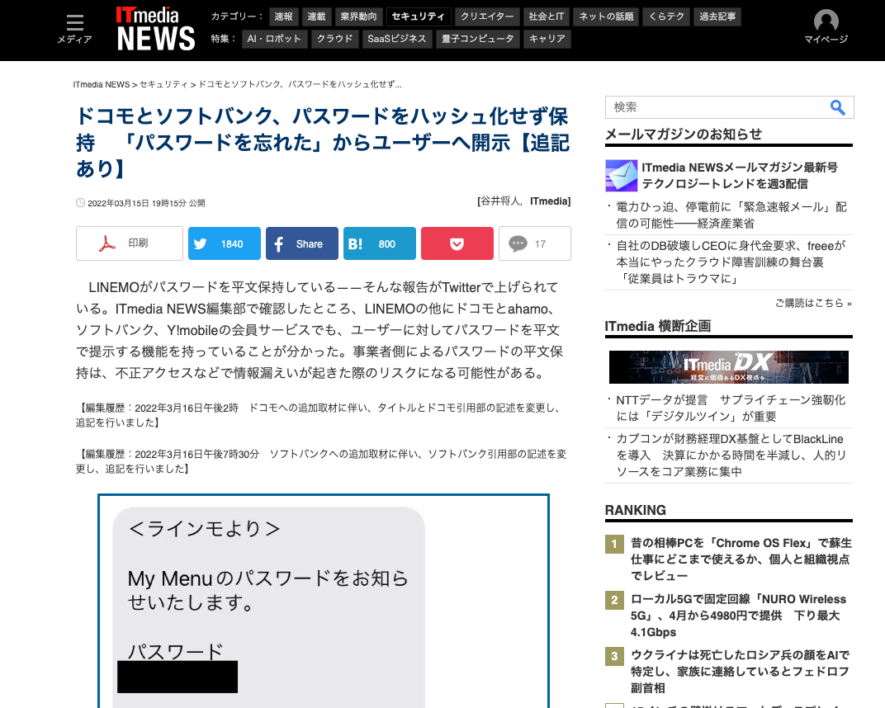

# アプリを構築しよう...?

> 🤔 : 「よし、アプリの構想はもう考えてある!」
> 🤔 : 「ネットワークについての勉強もできた!」
> 🤔 : 「APIってのを使えばいい感じにアプリ作れそう!」
> 🤔 : 「最近よく聞くAWSってとこでサーバー借りればよさそう!」
> 🤔 : 「いや、待てよ、**アプリのセキュリティ、大丈夫かな...?**」

アプリ開発時に気をつけたほうがよいことを紹介

---

# データベースって大事

データベースの中のデータって大事ですよね

* ユーザーデータ
* 履歴データ
* 学習データ
* 機密情報

などなど

---

# SQLインジェクション[^1]

例えば、アプリの中でユーザーのIDを入力してもらって、その該当ユーザーの情報を表示するアプリがあったとします

```sql
SELECT * FROM user WHERE id=‘$ID’
```

`$ID`の中にユーザーの入力を入れる

例えば
```sql
SELECT * FROM user WHERE id=‘taro’
```
なら、`taro`のユーザーデータを取得できる

[^1]: https://www.shadan-kun.com/waf/sql_injection/

---

# SQLインジェクション

基本のクエリ

> 🔍 「taro」

```sql
SELECT * FROM user WHERE id=‘taro’
```

では、このようにフォームに入力すると...?
> 🔍 「taro’ or ‘A’=‘A」

---

# SQLインジェクション

では、このようにフォームに入力すると...?
> 🔍 「taro’ or ‘A’=‘A」

```sql
SELECT * FROM user WHERE id=‘taro’ or ‘A’=‘A’
```

このSQL文の場合、id=‘taro’が成り立つ、**または‘A’=‘A’が成り立つ**クエリを抽出する

つまり、`user`テーブルのすべての情報が流出してしまうことに...

---

# SQLインジェクション

このような意図しないSQL文を送信されて情報が流出してしまう攻撃のことを**SQLインジェクション**という

> インジェクション: 注入する

**対策方法**

* プレースホルダーの利用 (SQL構文と入力値を分けて処理する)
* エスケープ処理 (SQL文っぽいのをSQL文として扱わないように無効化する)
* アプリケーションに渡されるパラメーターにSQL文を直接指定しない (if文などを活用して分離)

一番手っ取り早く効果的な対策はORM (Object–relational mapper)を活用する

Pythonの場合はSQLAlchemy, SQLModelなどがある

---

# SQLインジェクションされても大丈夫なようにする

もし、SQLインジェクション攻撃をされて、パスワードを含むユーザーのデータが流出してしまったら...

被害を少しでも減らすための工夫 → データの暗号化

---

# SQLインジェクションされても大丈夫なようにする

特にパスワードなど、機密情報を保護するために、データベースに格納した値を暗号化して、少しでも被害を拡大しないようにすることが重要

ハッシュ化は**必須**

---

# ハッシュとは



---

# ハッシュとは

ハッシュ関数というものがあり、その関数に通した後の値のことをハッシュ値という

> 「パスワード」 → 🗳️ (ハッシュ関数) → 「ハッシュ値」

> 「ハッシュ値」 → 🗳️ (逆ハッシュ関数?) → 「くぁwせdrftgyふじこlp」

ハッシュ値は不可逆: 元のパスワードを特定することはできない

同じ値をハッシュ関数に入力すれば同じハッシュ値が帰ってくるので、パスワード認証自体はできるが、データベースの中身が流出したとしても、そのデータからパスワードを判定するのは難しいので、二次災害を防ぐことができる

---

# ハッシュ化したパスワードが流出してしまった場合

ハッシュ化したパスワードが流出してしまった場合、どうなりますか?

* 攻撃者が元のパスワードを推測しやすくなる
* 推測したもとのパスワードを使って他のサイトに攻撃をしかける

→ **ブルートフォースアタック (総当たり攻撃)** のもと

> eg: アルファベット小文字のみ、6桁のパスワードの場合、約37分で解読できてしまう
> 近年は、パソコンのスペックも向上しているので、もっと早く解けてしまう可能性が...

---

# ブルートフォースアタック対策

* 認証時に時間のかからない動作でもあえて`sleep`を入れて時間稼ぎする
* パスワードの要件を厳しくする (eg: 大文字小文字記号数字を含む16桁以上)
* パスワードの使い回しをさせない (パスワードマネージャーの推奨)

---

# ブルートフォースアタック対策

* パスワードレス認証
* 2段階認証 (2FA, Two Factor Authentication)

> 😃 「cd ../」はSlackを使ったパスワードレス認証です!

---

# パスワードレス認証や2FAの関連技術・規格

> * OAuth2
> * OpenID Connect
> * SAML, SSO (Single Sign-on)
> * FIDO

---

# パスワードや認証以外のセキュリティ

> 😃 : 「よし、パスワードレスにしたし、認証周りはばっちりだね!」
> 👮‍♂️ : 「ちょっとそこの君! `uuid4`使ってる?」
> 🤔 : 「なんですかそれ、おいしいんですか?」

データベースにデータを保存するとき、プライマリーキーってどのデータ型使ってますか?

`int`をベースにした`serial`や、`bigserial`だと、攻撃されやすいかも...?

---

# なぜ`int`ベースだと攻撃されやすいのか

例えばユーザーの情報を下記のURLで見れるとします

```
https://shop.example.com/users/121
```

一見、「あぁー、URLにプライマリーキーそのまま使ってるのかなー」ってみなさん思いますよね?

そこまではいいんですが、このような使い方だと下記のURLアクセスしたら別のユーザーのデータが出てきそうじゃないですか?

```
https://shop.example.com/users/120
```

---

# なぜ`int`ベースだと攻撃されやすいのか

```
https://shop.example.com/users/120
https://shop.example.com/users/121
```

このように、プライマリーキーをintにして、そのキーをそのまま使うと、意図しないアクセスがされてしまう可能性が...

そこで`uuid4`の出番!

---

# `uuid4`とは

UUID (Universally Unique Identifier)とは、

> ソフトウェア上でオブジェクトを一意に識別するための識別子

である。

`uuid4`を使った場合、`6671b231-792e-440e-93fd-767854cbcedf`というのがユーザーID (プライマリーキー)の代わりになる

→ 推測されにくい

---

# おさらい

* ORMを使ってSQLインジェクションからアプリを守る
* ユーザーを保護するために、認証はできればパスワードレス、もしくは二段階認証に
* パスワードのハッシュ化は必須!! 別途ブルートフォースアタックされにくい対策を
* プライマリーキーは面倒でも`uuid4`を使っていこう