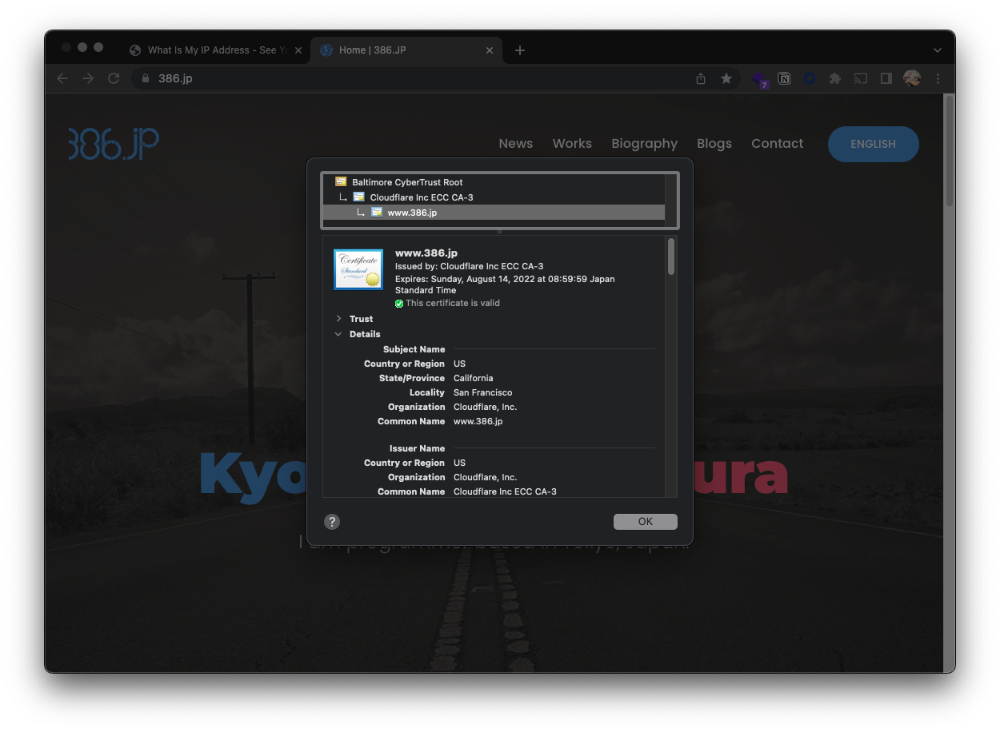

# サーバー運営上のセキュリティも大事

> 😃 : 「よし、認証周りもデータベース周りもばっちりだ!」
> 😃 : 「アプリを公開するぞ!!」
> 👮‍♂️ : 「サーバーを建てる上でのセキュリティ、だいじょぶそ?」
> 😱 : 「あっっ...」
> 👮‍♂️ : 「いくら素晴らしいソフトウェアを作っててもサーバーに侵入されちゃ終わりだよ」

---

# サーバーサイドセキュリティのきほんの「き」
## ファイアウォール

ファイアウォールとは、

> 企業などの内部ネットワークをインターネットを通して侵入してくる不正なアクセスから守るための「防火壁」

である。

パケットフィルタリングやアプリケーションゲートウェイなどの種類がある。

---

# ファイアウォールとは

**パケットフィルタリング**
> パケットのヘッダを解析して判断する
> 強力で柔軟だが、ものによっては設定が難しく、セキュリティホールが生まれる可能性がある

**アプリケーションゲートウェイ**
> サービスごとに認証する
> 細かい制御設定が難しい

---

# ファイアウォールとは

一般的なクラウドサービスでは、「パケットフィルタリング」の中でも「スタティックパケットフィルタ」と呼ばれる、IPアドレスやポート番号、プロトコルでアクセス制御を行う。

AWSではセキュリティグループがそれに当たる

---

# ファイアウォールのセットアップ例

* SSH (TCP, 22)は自宅のIPアドレス以外からの通信はブロック
* HTTP (TCP, 80)は全世界からアクセスOK

---

# サーバーへログインする際にはこれだけでは不十分

前のセクションで紹介した**ブルートフォースアタック**のような形でサーバーの管理者のユーザー名とパスワードを総当りされてしまったら、サーバーに攻撃者が侵入してしまう可能性が...

→ 公開鍵認証でSSHアクセス

---

# 公開鍵認証とは

公開鍵認証とは、

> 公開鍵+秘密鍵の組み合わせを使って認証を行う方式

である。

鍵穴 (公開鍵)と鍵 (秘密鍵)のイメージ。この2つが合ってはじめて認証される。


---

# 公開鍵認証とは

普段、みなさんがパソコンにログインするときはパスワードを使いますが、推測されてしまうなど、セキュリティ的にリスクがある。
一方で、公開鍵認証だと、秘密鍵を持っている人しか入れないので、秘密鍵が漏洩しない限り、セキュアな接続方法。 (公開鍵認証は組み合わせが膨大すぎるので実質破ることはできない)

---

# SSHで公開鍵認証: 準備編

公開鍵・暗号鍵の組み合わせを生成

```bash
ssh-keygen -t rsa
```

`id_rsa`ファイル (秘密鍵)と`id_rsa.pub`ファイル (公開鍵)の2つが生成される

> * **秘密鍵 (`id_rsa`)**: クライアントに渡す
> * **公開鍵 (`id_rsa.pub`)**: サーバーに登録する

---

# SSHで公開鍵認証: サーバー編

`~/.ssh/authorized_keys`というファイルに公開鍵の中身を**1つ1行づつ**で登録していく

---

# SSHで公開鍵認証: クライアント編

`~/.ssh/config`ファイルに下記の内容追記

```ssh-config
Host ssh-demo
        HostName HOSTNAME
        User ubuntu
        IdentityFile ~/.ssh/id_rsa
```

`IdentityFile`の`~/.ssh/id_rsa`は秘密鍵の保存場所のパス

---

# SSHで公開鍵認証: クライアント編

秘密鍵をセキュアにする


> **最初の1文字**
> そのオブジェクトの種類
> **2-4文字目**
> ファイル所有者に対するアクセス権限
> **5-7文字目**
> ファイルの所有グループに対する権限
> **8-10文字目**
> その他のユーザー等に対する権限

`ls -l`コマンドでファイルに対する権限を確認できる

---

# SSHで公開鍵認証: クライアント編

秘密鍵をセキュアにする


`ls -l`コマンドでファイルに対する権限を確認できる


> eg: `my-awesome-keypair.pem`ファイルはファイル所有者 (自分)は読み取り、書き込み、実行ができるが、それ以外の人はなにもできない

---

# SSHで公開鍵認証: クライアント編


今回は、ファイル所有者 (自分)しか読み取り、書き込み、実行ができないようにしたいので、下記のような権限にする

```bash
chmod 700 id_rsa
```

ちなみに、権限が適切でないとSSHしようとするときに怒られる

---

# 公開鍵認証はGitHubのレポジトリにアクセスする際にも使える!

特にプライベートレポジトリにアクセスする際、APIキーをGitHubで発行してそれをサーバーで使ってしまうと、意図しないレポジトリに対するアクセス権限も与えてしまう可能性が

GitHubではデプロイキーという仕組みで、公開鍵認証の仕組みを使って特定のレポジトリのみアクセスできるようにできる

> 公開鍵認証の概念を使ってサーバー・GitHubプライベートリポジトリ間の通信を確立
> GitHub側に鍵穴を作って、サーバー上の鍵を使ってリポジトリにアクセス

---

# GitHubで公開鍵認証: サーバー編

公開鍵・暗号鍵の組み合わせを生成

```bash
ssh-keygen -t rsa
```

**Hint!**
> このとき、鍵のファイル名は`/home/ubuntu/.ssh/github_id_rsa`にしておく
> passphraseは入れないでおく

`id_rsa`ファイル (秘密鍵)と`id_rsa.pub`ファイル (公開鍵)の2つが生成される

> * **秘密鍵 (`github_id_rsa`)**: サーバー側に持っておく
> * **公開鍵 (`github_id_rsa.pub`)**: GitHubに登録

---

# GitHubで公開鍵認証: サーバー編

生成した鍵のうち、公開鍵をGitHubに登録するために表示しておく

```bash
cat ~/.ssh/github_id_rsa.pub
```

---

# GitHubで公開鍵認証: GitHub編

GitHubプライベートリポジトリ内、設定を開き、Deploy keysの設定を開く


---

# GitHubで公開鍵認証: GitHub編

Add deploy keyから公開鍵を追加し、Add keyでキーを追加
Allow write accessのチェックボックスでサーバーからレポジトリに対する書き込みを制限することができる


---

# GitHubで公開鍵認証: GitHub編

鍵が登録できました


---

# GitHubで公開鍵認証: サーバー編

GitHubプライベートリポジトリにSSH経由でアクセスする。
そのための接続設定を書き込んでおく

```bash
nano ~/.ssh/config
```

```ssh-config
Host github github.com
        HostName github.com
        User git
        IdentityFile ~/.ssh/github_id_rsa
```

---

# GitHubで公開鍵認証: サーバー編

リポジトリをクローンしてくる
このとき、HTTPSではなく**SSH**でgit cloneしてくる

```bash
git clone git@github.com:386jp/ddos-web-2022.git
```

---

# 公開鍵認証にも限界はある

いくらファイアウォールの設定をしていても、いくら公開鍵認証を設定していても、少しの設定ミスやソフトウェアのバグで攻撃されてしまうかも...

もう少し段階を踏んでSSH接続をセキュアにする

→ 踏み台サーバーの登場

---

# 踏み台サーバーとは

basionサーバー / 踏み台サーバーとは、

> 目的のサーバーにログインするための中継サーバーのこと

である。

踏み台サーバーを使った環境の場合、

> 利用者はサーバーに対して直接アクセス (port 80, 443など)
> 管理者は踏み台を経由してアクセス (port 22など)

となる

---

# 踏み台サーバーとは


---

# 踏み台サーバーの構築方法


> * 踏み台サーバーとWebサーバーは同じプライベートネットワーク内に置く
> * プライベートネットワーク内では踏み台からWebサーバーのSSH接続だけ許可
> * 外部のネットワークからはWebサーバーの`80`, `443`ポートのみアクセス許可

---

# 踏み台サーバーの接続方法

```ssh-config
### The Bastion Host
Host bastion-host-nickname
  HostName bastion-hostname

### The Remote Host
Host remote-host-nickname
  HostName remote-hostname
  ProxyJump bastion-host-nickname
```

`ProxyJump`を使って、踏み台サーバーを指定しておく

---

# なぜここまでSSHするために関門を設ける必要があるのか

Webサーバーを公開していたら、そのサーバーのIPアドレスに対して攻撃が来る

特に、AWSなどのパブリッククラウドでサービスをホストしている場合、AWSのIPアドレスの範囲は決まっているので、攻撃者はそのIPアドレスの範囲を集中的に攻撃するので、余計に攻撃されやすい

---

# サーバー、ソフトウェア以外にも通信にも気を配るべし

パスワードなどの情報は特に、通信を暗号化する必要がある。

→ SSL通信

---

# SSL通信とは

SSL (Secure Sockets Layer)とは、

> 送受信しているデータを暗号化する通信手順

である。


公開鍵認証の仕組みを使ってクライアントとサーバー間の通信を暗号化する

> 現在だとTLS (Transport Layer Security)という方式が使われているが、SSLという言葉が依然として馴染み深い。

---

# SSL通信のメリット

通信を暗号化したり、ドメインが本物だと証明できるので、

> * データの盗聴
> * データの改竄 (かいざん)
> * なりすまし

これらを防ぐことができる

---

# SSL通信の概要


---

# SSL通信の概要


---

# SSLサーバー証明書とは

SSLサーバー証明書によって、公開鍵がそもそも正しい鍵かどうかを証明することで、なりすましの防止ができます。

SSLサーバー証明書を発行する機関のことを認証局(CA= Certification Authority)と呼ぶ

---

# [Activity] SSL証明書を確認してみよう

[386.jp](https://www.386.jp)の証明書を確認してみよう

まずは、URLの先頭が`https`で始まっていることを確認


---

# [Activity] SSL証明書を確認してみよう


---

# [Activity] SSL証明書を確認してみよう


---

# [Activity] SSL証明書を確認してみよう



---

# 証明書以外の方法でもクライアントを保護する

近年では、SSL証明書とCA (認証局)の組合せ以外に、HSTS (HTTP Strict Transport Security)でこのドメインがSSL使っていることをブラウザ側に記憶させる技術や、Let's Encryptなどの無料SSL証明書配布サービス、常時SSLでないとGoogle等で検索順位が下がるなど、SSL技術に加え、サポートする形で様々な技術などが発達しており、情報の盗み見などへの対策がされている

---

##### ここから発展的内容

---

# DDoSってなんだっけ

> 🤔 脱データサイエンスオンラインセミナー

ではなく、、、

---

# DDoSとは

DDoS (Distributed Denial of Service)攻撃とは、

> 対象のウェブサイトやサーバーに対して大量のリクエストを送りつけてサービスを停止させる攻撃のこと

である。

---

# DoSとDDoS

> **DoS** (Denial of Service)
> 攻撃元が1つ
>
> **DDoS** (Distributed Denial of Service)
> 攻撃元が複数

一昔前まではサーバーが貧弱だったので、1つの攻撃元でも十分なダメージを与えることができたが、現在はサーバーも高性能化・耐障害性が上がったためかんたんにサービスを落とせなくなったので、マルウェアなどで攻撃元のPCを増やした上で攻撃を行う方式になってきている

いわゆる田代砲は複数人でやってるので実質DDoS

---

# DDoSを防ぐには

* 攻撃元のIPアドレスからのアクセスを遮断する
* CloudFlareのようなDDoS対策サービスを噛ませる

ちなみに、CloudFlareの回しもんではありません

---

# CloudFlare繋がりで言うと...

CloudFlareはWAFというサービスも展開している

WAF (Web Application Firewall)とは、

> Webアプリケーションの前面やネットワークに配置し、脆弱性を悪用した攻撃を検出・低減する対策のこと

である。

---

# WAF導入のメリット

WAFを導入することで、SQLインジェクションをはじめ、Webアプリに来る攻撃を防御できる

ただ、WAFを信用しすぎるのはよくないので、自分でもしっかり対策した上でお守り的な存在としてWAFも併用するのがおすすめ

---

# おさらい

* ORMを使ってSQLインジェクションからアプリを守る
* ユーザーを保護するために、認証はできればパスワードレス、もしくは二段階認証に
* パスワードのハッシュ化は必須!! 別途ブルートフォースアタックされにくい対策を
* プライマリーキーは面倒でも`uuid4`を使っていこう
* ファイアウォールや公開鍵認証、踏み台サーバーを使ってSSH接続をよりセキュアに
* SSL通信で通信を暗号化して通信を盗み見られたりなりすまされたりしないように
* DDoS対策やWAF設置をするとなおよし (CloudFlareおすすめ)