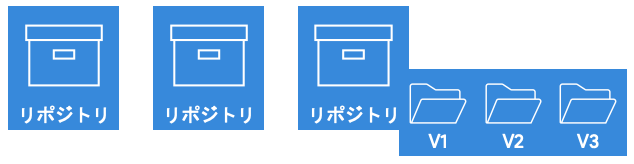
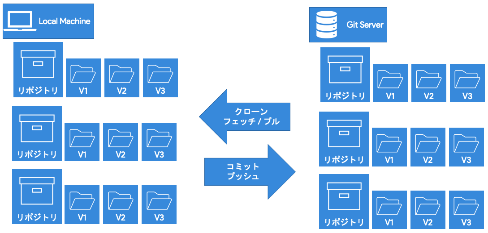
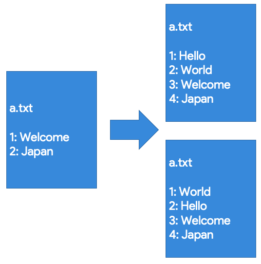
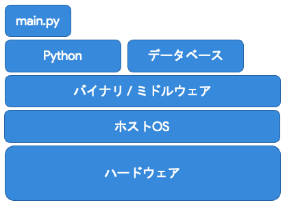
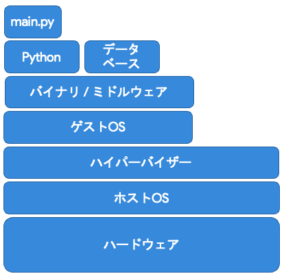
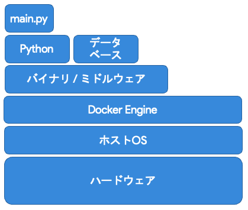
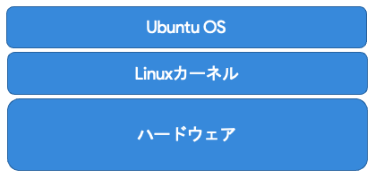
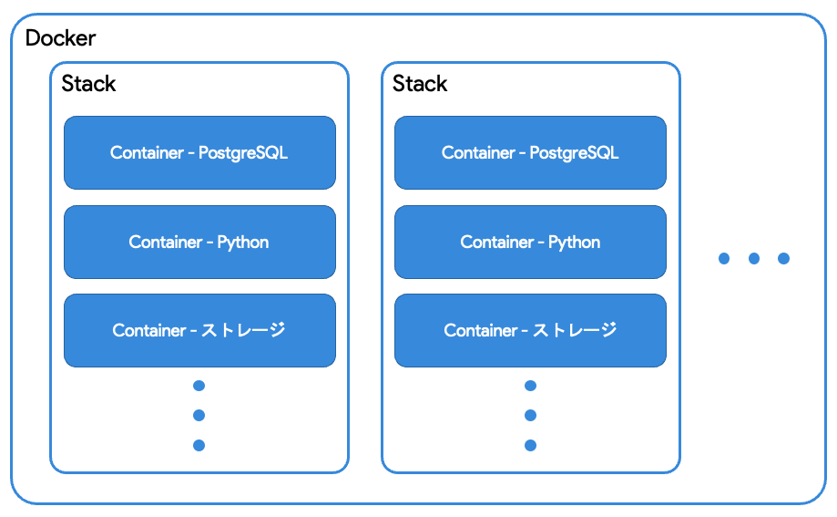

# Webアプリ開発で使われる技術スタック

Webアプリ開発で使われる主な技術スタックの一覧 (個人的に推しているものも含む)

* Git
* Docker

---

# Gitとは

バージョン管理システム (VCS)とは、

> ファイルやファイルの集合の変更履歴を記録しておくシステムで、過去の状態を復元したり、変更内容を差分を表示することができるもの

である。

GitはVCSの一種である。

---

# Gitとは

* **いつ**変更したか
* **誰が**変更したか
* **どこを**変更したか
* **何のために**変更したか

が記録される。

→ バージョン管理システムの代表としてGitが挙げられる

---

# Gitとは

Gitとは、

> バージョン管理システムの一つで、エンジニアの中では使用されることが多いバージョン管理システム

である。

---

# Gitの特徴

* 手軽にバージョン切り替えができる
    * 処理が高速
* 保守性が高い
    * 分散型の管理
* 複数人で作業するのに適している
    * 賢いマージ (結合・統合)アルゴリズム
* オフラインで作業ができる
    * ローカルでのバージョン管理

---

# Gitの利点

* **ネット環境がなくても**手元の環境で作業ができる
* 他人の変更を**むやみに壊さない**
* 親玉 (リモートリポジトリ)を**むやみに壊さない**
* 自分の環境が死んでも親玉 (リモートリポジトリ)や他の人のローカル環境で**生きている**

---

# Gitの概要: 基本操作

Gitでは、個々のプロジェクトを「リポジトリ (Repository)」と呼ぶ



基本的に、Gitサーバーと呼ばれるサーバーにリポジトリのデータを置き、それを自分のマシンに複製する。 → 「**クローン (Clone)**」

また、そのリポジトリの最新情報 (差分)を取得することを「**フェッチ (Fetch)**」、最新情報をダウンロードすることを「**プル (Pull)**」と呼ぶ

---

# Gitの概要: 基本操作


逆に、自分のマシンでリポジトリの内容に変更を加え、その変更を記録することを「**コミット (Commit)**」、変更内容をGitサーバーにアップロードすることを「**プッシュ (Push)**」という

---

# Gitの概要: リポジトリの種類

Gitサーバー側のリポジトリ: 「リモートリポジトリ (Remote Repository)」
自分のパソコンにクローンしたリポジトリ: 「ローカルリポジトリ (Local Repository)」



---

# Gitの概要: ブランチ

例:
> * Aさん: `a.txt`の1行目に「Hello」と追記
> * Bさん: `b.txt`の1行目に「World」と追記



このように、同時にファイルが変更された場合、どうファイルを変更・統合すればよさそう?

---

# Gitの概要: ブランチ

例:
> * Aさん: `a.txt`の1行目に「Hello」と追記
> * Bさん: `b.txt`の1行目に「World」と追記


このような状態「**コンフリクト (Conflict)**」

---

# Gitの概要: ブランチ

コンフリクトが1個ならまだ解決できるが、10個、100個もあったらどうする?

→Gitでは、コードを複数のバージョンに分けて管理する - 「**ブランチ (Branch)**」

---

# Gitの概要: ブランチ

* 起点となるのはメインブランチ / マスターブランチ (Main Branch / Master Branch)
* そこから枝分かれ・分岐してファイルを管理する
* 基本的に`main / master`ブランチに直接変更は加えない

アジャイル開発などでは、開発タスク (**イシュー / Issue**)ごとにブランチを分けたりする


---

# Gitを使った開発の流れ

1. 要件定義 - Issue作成
   * Issueと呼ばれる開発タスクが与えられて、どういう機能を追加するのか / どういう問題が発生しているのかをIssueに書く
1. ブランチ作成
   * IssueにはIssue番号が割り当てられるので、その番号をもとにブランチに名前付け (eg: issue_04)
1. コード編集

---

# Gitを使った開発の流れ

4. メインブランチに統合する - プルリクエスト発行
   * メインのコードに統合 / マージしてもらうために、プルリクエスト (Pull Request)を発行
   * Pull Requestには、どのブランチをどのブランチに対して統合するのかを設定する
   * Pull Requestでは、どのような変更が加えられるのか確認できる (コードレビュー)
1. コードレビュー
   * Issueとプルリクエストに書かれているファイルの変更内容をもとに、ブランチを統合していいのか確認する
1. マージ / Issueを閉じる
   * 実際にコードを統合する

---

# Gitを採用しているアプリ

このGitサーバーを運営してくれているサービスが世の中にはたくさんある

GitHub
GitLab

---

# [Activity] Gitは練習あるのみ!

あいうえお作文を例に練習してみましょう。

[github.com:386jp/git_example](https://github.com/386jp/git_example/)

---

# Dockerとは

Dockerとは、

> Docker社が開発している、コンテナ型の仮想環境を作成、配布、実行するためのプラットフォーム

である。

→ 普通にローカルマシンに環境を構築するのと何が違うのか?

---

# 環境構築手法: ベアメタル



> 階層は少ないが、他のPCに移植しにくい

* 階層が少ない
    マシンの性能を最大限発揮できる
* 他のPCに移植しにくい
    サーバーなどの場合、たくさんのサーバーで同じプログラムを同じように動かすことで大量のクライアントを捌いているが、大量のサーバーに同じプログラムを同じ環境で動かすのが難しくなる

みなさんの開発環境はほとんどこれでは?

---

# 環境構築手法: VM (仮想マシン)



> 他のPCに移植しやすいが、階層が多い

* 階層が多い
    マシンの性能を仮想化などにも持っていかれるので、最大限のパフォーマンスを出しにくい (例: マシンに投資してもその80%くらいの性能しか出ない)

---

# 環境構築手法: コンテナ



> 他のPCに移植しやすいし、階層も比較的少ない

Dockerはこのコンテナに含まれる

---

# コンテナの仕組み



Linux系のOSでは、Linuxカーネルと呼ばれるものの上にそれぞれのOSの機能が載っている

→この特性を活用して、Linuxカーネルだけホスト・Docker共通で使い、Dockerコンテナ内で別のOS (ディストリビューション)のLinuxカーネルより上の階層を再現できる

---

# コンテナの仕組み


Linux系のOSでは、Linuxカーネルと呼ばれるものの上にそれぞれのOSの機能が載っている

→この特性を活用して、Linuxカーネルだけホスト・Docker共通で使い、Dockerコンテナ内で別のOS (ディストリビューション)のLinuxカーネルより上の階層を再現できる

軽量だけど、確実にアプリの実行環境を共有できる、かつ、コードに書かれた状態で環境を共有できる (Infrastructure as Code, IaCにも繋がる)

---

# [余談] Infrastructure as Codeとは

Infrastructure as Codeとは、

> コンピュータやソフトウェアの構成や設定に関する情報をプログラムコードとして記述し、専用のソフトウェアによって自動的に適用する手法

である。

最近では、Dockerなどだけでなく、AWSでどのようなサーバーを何台建てるのか、というのもコードで定義できるようになってきている

---

# Dockerの使い方



---

# Dockerを扱う上で重要な2つのファイル

* `Dockerfile`
> * コンテナの構成内容 (設計図)が書かれている
> * シェルスクリプトのような形で`apt install`などの環境構築時に必要なコマンドを書いておける
> * 基本的にDB接続情報を含む環境変数などのあとで変わる可能性のあるものは`docker-compose.yml`で設定するため、そこで変更できるように特殊な書き方をする

* `docker-compose.yml`
> * スタックの構成内容 (設計図)が書かれている
> * ポート番号や環境変数など、あとから変更する可能性のある内容を書いておく
> * 通信、ストレージなどの設定もここで行う

---

# `Dockerfile`の例

FastAPI (Python)アプリの例

```Dockerfile
# ベースイメージを選択
FROM python:3.9.4-slim

# コンテナの中のメインとなるディレクトリを指定
WORKDIR /

# ファイルをコンテナにコピー
COPY ./app /app
COPY ./db-migration /db-migration
COPY ./pytest.ini /pytest.ini
COPY ./alembic.ini /alembic.ini
COPY ./requirements.txt /requirements.txt

```

---

# `Dockerfile`の例 (続き)

FastAPI (Python)アプリの例

```Dockerfile
# 必要なライブラリをインストール
RUN apt-get update && \
    apt-get install -y \
        build-essential \
        python3-dev \
        python3-setuptools \
        make \
        gcc

RUN python3 -m pip install -r requirements.txt

# コンテナをすっきりさせるために不必要なものはアンインストール
RUN apt-get remove -y --purge make gcc build-essential && \
    apt-get autoremove -y && \
    rm -rf /var/lib/apt/lists/*

# タイムゾーンを設定
RUN echo $TZ > /etc/timezone

# アプリを実行
CMD [ "/usr/local/bin/gunicorn", "--worker-tmp-dir", "/dev/shm", "-k", "uvicorn.workers.UvicornWorker", "app.main:app", "--reload", "--bind", "0.0.0.0:8000" ]

# 公開するポートを定義
EXPOSE 8000
```

---

# `docker-compose.yml`の例

```yaml
version: "3.8"

# 使うコンテナと環境情報を設定
services:
  api:
    build: . # 先程の`Dockerfile`を元にコンテナを作成
    expose:
      - 8000
    ports:
    - 8000:8000 # 外部に公開するポート
    restart: always # アプリ (コンテナ)が死んだら自動的に再起動するようにする
    environment:
      DB_HOST: ${DB_HOST}
      DB_PORT: ${DB_PORT}
      DB_NAME: ${DB_NAME}
      DB_USER: ${DB_USER}
      DB_PW: ${DB_PW}
      TZ: ${TZ}
    depends_on:
      - db


```

---

# `docker-compose.yml`の例 (続き)

```yaml

  db:
    image: postgres:13-alpine # 既存のイメージもある
    volumes:
      - postgres:/var/lib/postgresql/data
    expose:
      - 5432
    restart: always
    environment:
      POSTGRES_DB: ${DB_NAME}
      POSTGRES_USER: ${DB_USER}
      POSTGRES_PASSWORD: ${DB_PW}
      TZ: ${TZ}

volumes:
  postgres:
```

---

# なぜコンテナを使うのか?

* 仮想マシンのような環境の複製のしやすさと、動作環境の安定さ・速度が両立している
* 環境を容易に複製できる
    * 近年流行ってるクラウド - アクセス量が多いときはサーバーを増やして、そうでないときは減らす (Kubernetes)
    * 開発者側で同じ環境を整備できる

---

# おさらい

* Gitでソースコードを管理
* Dockerで開発環境をかんたんに構築