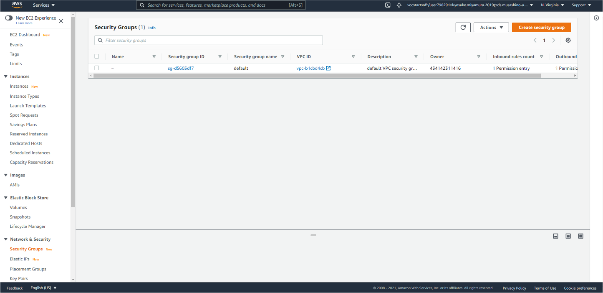

# Webアプリのデプロイで使われる技術スタック

Webアプリのデプロイで使われる主な技術スタックの一覧 (個人的に推しているものも含む)

* AWS
* SSH
* NGINX
* CloudFlare

---

# 作ったWebアプリを公開したい


---

# オンプレミス vs パブリッククラウド

**オンプレミス**
> 自宅や会社内で自分たちでサーバーを購入し、立ち上げること

**パブリッククラウド**
> AWS (Amazon)やGCP (Google)、Microsoft Azureなどの会社が運営しているサービスで、いつでも必要な分だけサーバーを借りることができる、またデータベースやS3をはじめとするオブジェクトストレージなど、パブリッククラウドの設備を使って運営されるサービスもある (マネージドサービス)

その他にも**レンタルサーバー**のような、オンプレミスとパブリッククラウドの中間のものもある。

---

# なぜクラウドを選ぶのか

* いつでも必要な分だけサーバーを借りることができる (オンプレやレンタルサーバーではできない、ユーザーの急増に対応できる)
* 既に組み上がってメンテナンスされているサービスをアプリに組み込むことができる (S3など)
* 世界中様々な場所にあるため、地理的安全性が保証される → 安定した運用ができる

---

# パブリッククラウドの代表例、AWS

AWS (Amazon Web Services)とは、Amazonが運営するパブリッククラウドサービス。

大昔、、、

> 🤔 (Amazonの中の人): 「よし、サーバー建て終わったぞ!」
> 🤔 : 「これで多くのユーザーさんに安定してAmazonで買い物してもらえるぞ!」
> 🤔 : 「けど、ユーザーが少ないとき、このサーバーたちをずっと動かしてるのは無駄だよなー...」
> 🤔 : 「ユーザーが増えたときだけサーバー使って、少ないときは止めておくとかしかないかなー...」
> 🤔 : 「あっ、ユーザーが少ないときは他の人にサーバーを貸せばいいんじゃね?」
> 😃 : AWS (EC2)誕生

---

# パブリッククラウドの代表例、AWS

その後、GoogleやMicrosoftなどもパブリッククラウドサービスを始めたが、AWSが一番人気 (体感)

ここでは、AWSにフォーカスして、Webアプリを立ち上げる際に必要になりそうなサービスを紹介

---

# とりあえずEC2

EC2は、とりあえずサーバー借りてアプリ立ち上げよう、っていうときにまず使うサービス (になると思う)

EC2では、いつでも好きなときに好きなOS、スペックのマシンを借りることができる

---

# EC2の操作

AWSにログイン


---

# EC2の操作

ホーム画面


---

# EC2の操作

メニューからEC2に行く


---

# EC2の操作

サーバー一覧


---

# EC2の操作

セキュリティグループも設定できる



---

# [余談] AWS セキュリティグループとは

一般的に言う「**ファイアウォール**」のこと。

どこから何番のポートに対するアクセスを許可するのかを定義する。

AWS EC2では、インスタンス (サーバー)自体のファイアウォールは無効化され、セキュリティグループですべてを管理するようになっている

---

# EC2の操作

好きなOSを選ぶことができる


---

# EC2の操作

Ubuntuもちゃんと選べるし、x86 / armも選択可能


---

# [余談] x86 / armとは

> 🤔 通称Apple Siliconで話題のArmプロセッサ、今までのx86との違いはなんなんだろう?

---

# [余談] x86 / armとは

**arm**
> * もともとモバイル向け
> * 省電力
> * 命令を可能な限りシンプルに保つことに重点を置いている
> * 回路が少ないのでチップを小さくできる

**x86**
> * もともとデスクトップ・サーバー向け
> * 高性能・高スループット (処理能力)
> * 大量の柔軟性を持って複雑なタスクを実行することに重点を置いている
> * チップが大きい分、様々な処理を行える

---

# [余談] x86 / armとは

> ソフトウェアの面で大きな違いがある

armとx86ではソフトウェアからCPUに命令するときの構造 (言語のようなもの)が違うので、相互的に使うのが難しい

`qemu`というものなどを使うことで命令を翻訳・変換しながら使うこともできるが、互換性問題がたまに発生したり、動作が遅かったりと、デメリットが大きい

---

# EC2の操作

スペックも自由に選択できる


---

# EC2の操作

ストレージも好きな分だけ


---

# EC2の操作

ファイアウォールもサーバーごと or 複数まとめて設定可能


---

# EC2の操作

キーペアを使ってサーバーへのログインを制限


---

# EC2の操作

数分あればサーバーを立ち上げることができます


---

# EC2の操作

数分あればサーバーを立ち上げることができます


---

# AWSのメリット・デメリット

**メリット**
> * 手軽にサーバーを立ち上げることができる
> * 必要最低限のものだけ借りることができる

**デメリット**
> * 設定を誤ると思わぬ出費がある
> * IPアドレスの範囲が決まっているので攻撃が来やすい

---

# 学生によってのAWSのメリット

AWS Educateと呼ばれるプランがあり、学生は大学などが発行するメールアドレスでAWS Educateに登録することによって、一定量AWSを無料で使うことができる

→ 最近、使える無料枠が大幅に制限され、登録するだけではAWSの機能は使えなくなってしまった模様

AWSの全機能が使えるわけではないので要注意 (IAMアカウントが発行されるだけ)

---

# じゃあ、AWS使えないんじゃ何使うの?

* 他のクラウドサービス
  * Google Cloud
  * Microsoft Azure
  * Oracle Cloud (無料枠がめっちゃ強い)

* プロキシサービス
  * ngrok
  * CloudFlare Argo Tunnel

ここではCloudFlare、CloudFlare Argo Tunnelについて説明します

---

# CloudFlareとは

CDN (Content Delivery Network)サービスを提供する企業の一つ

CDNの他にDNSサーバーやホスティングなど、ドメインに関連するサービスを展開

---

# CloudFlareの代表的サービス

**CDNサービス**
* 近所のエッジサーバーからリモートサーバーのデータをダウンロードできるようにし、Webサイトへのアクセスを高速化

**DNSサービス**
* IPアドレスと自分のドメインを紐付けることができる (DNSサーバー)

**CloudFlare Pages**
* サイトをホスティングできる (詳細はポートフォリオ講座にて)

**WAF (Web Application Firewall)**
* SQLインジェクションなど、Webアプリに対する攻撃を自分たちが建てたサーバーの前で防御 (詳細はセキュリティ講座にて)

---

# CloudFlare Argo Tunnel

CloudFlareの機能の1つであるArgo Tunnelを使うことで、ローカルで運用しているサービスを**1コマンド**で公開することができる

```bash
brew install cloudflared
cloudflared tunnel --url localhost:8000
```

`https://lorem-ipsum.trycloudflare.com/`というようなCloudFlareのドメインでサービスを一時的に公開できる

---

# 実際にサーバーを建てるとして、どのような技術が必要?

* SSH
* NGINX
* Docker (前に説明したので割愛)

---

# SSHとは

SSH (Secure Shell)とは、

> リモートコンピュータと通信するためのプロトコル

である。

すべての通信が暗号化されてるので安全にサーバーにアクセスできる

---

# SSHの使いみち

* サーバーを操作する
* サーバーで動かしてるアプリをローカルでもアクセスできるようにする (SSHトンネリング)

---

# SSHトンネリングとは

SSH接続を使ってポートフォワーディングを行うことによって、サーバーで動かしてるアプリをローカルでもアクセスできるようにすること


---

# SSHトンネリングとは

サーバー上のポート8000で動かしたアプリをSSH通信をつかってローカルからアクセスできるようにする

→ サーバー動作検証など、一時的にアプリをテストするときに有効


---

# アプリを公開するために

SSHトンネリングは一時的なもの

実際にアプリとして公開するために、必要なものとしてプロキシが挙げられる

---

# プロキシとは

プロキシとは、

> インターネットに代理接続しアクセスするサーバのこと

である。

社内でのインターネットのフィルタリングや通信最適化に使うのもプロキシだが、今回は外部からアプリにアクセスする際の中継としてプロキシを使用する (リバースプロキシ)

---

# プロキシの種類

* フォワードプロキシ
* キャッシュサーバー
* 透過型プロキシ
* リバースプロキシ

---

## フォワードプロキシ

> 一般的にWEBプロキシサーバと言われているのは「フォワードプロキシ」です。クライアントとサーバの間に設置し「社内ネットワークー公開ネットワーク間」の通信の代理や中継を行います。また、WEBプロキシサーバを複数経由することを「多段プロキシ」と呼び、この技術は、ダークウェブなどで利用される匿名通信Tor（トーア）でも応用されています。

---

## キャッシュサーバー

> あるWEBサイトが配信するページや画像などのコンテンツを複製して保存しておき、送信要求があったときに、代理で送信するサーバのこと。これにより、サーバへの負荷軽減や接続の高速化が実現できます。また、このキャッシュサーバを設置し、コンテンツ配信を高速化する手法をCDN（コンテンツデリバリーネットワーク）と呼びます。
> 近年は、音楽や映画、ゲームなど、大容量コンテンツを高速で配信するためのデジタルコンテンツ配信サービスやECサイトなどで、この技術が利用されています。

---

## 透過型プロキシ

> 「Transparent Proxy」とも。フォワードプロキシに類似していますが、透過型の場合は、PC端末側のプロキシ設定ではなく、ネットワーク側の制御により裏で代理通信させるのが特徴です。透過型プロキシは、ユーザー側で迂回路を作ることができないため、セキュリティ上の安全性が担保されています。

---

## リバースプロキシ

> 「逆プロキシ」とも。リバースプロキシは、フォワードプロキシがクライアントの代理接続のために設置されるのに対し、WEBサイトへのリクエストを代理受付するためにWEBサーバの前に設置します。
> 外部ネットワークの通信をフロントで受け付けることで、直接WEBサーバへのアクセスができなくなるため不正アクセスを防止できます。また、キャッシュを保持することでWEBサーバへの負荷を軽減できる上、設定をすれば、特定のIPアドレスのみアクセス許可することができ、不正なアクセスを遮断する役割も果たします。

---

# リバースプロキシを活用しよう

アプリをデプロイするときはリバースプロキシを建てると便利

**NGINX (えんじんえっくす、んぎっくすっっ！！じゃないよ)** はリバースプロキシの一種

---

# リバースプロキシの必要性

> * Webサイトの表示高速化
> * サイバー攻撃の防御
> * 匿名性の確保

NGINXでは、SSL (HTTPS)通信の設定や、アクセス制御なども行えるので、アプリ単体で公開するのではなく、NGINXでアクセス制御等を行ってあげる

そのほかの利点として、NGINXを使うと、静的 (static)なファイルのホスティングができるので、画像アセットなどをNGINXに配信させて、同時に同じサーバーでアプリを公開する、という分業ができる。

---

# NGINXの設定ファイルの例

```nginx
# Upstreams
upstream backend {
    server localhost:8000;
}

# HTTP Server
server {
    listen 443;
    server_name test.386.jp;

    ssl on;
    ssl_certificate /etc/ssl/certs/cert_test-386-jp.pem;
    ssl_certificate_key /etc/ssl/private/key_test-386-jp.pem;
    ssl_protocols TLSv1 TLSv1.1 TLSv1.2;

    location / {
        proxy_pass http://backend;
    }
}

```

---

# おさらい

* Gitでソースコードを管理
* Dockerで開発環境・**デプロイ環境**をかんたんに構築

更に:

* AWSを使っていつでもサーバーをレンタルし、アプリを公開
* SSHで物理的に離れているサーバーでもアクセス可能
* NGINXでセキュリティを向上
* CloudFlareを使って自分のドメインを使ってアプリを安全に公開
* CloudFlare Argo Tunnelを使っていつでもどこでもアプリを手軽に公開

---

# これからに向けて

> これらの技術スタックや、Webセキュリティなどを考慮して、システム構成を考えてみましょう
>
> どのような技術を使えばユーザーにとって喜ばれるようなアプリが作れますか?