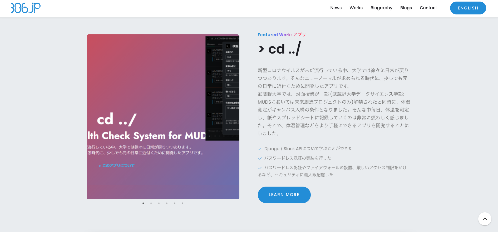
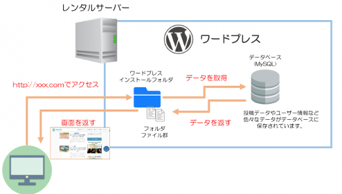

# ポートフォリオサイトのレベルを1mmだけ上げる講座

* デザイン
* 内容 (魅せ方)
* コンテンツ管理
* ブランディング
* UX

---

##### デザインについてはここでは扱いません!!

---

##### どう魅せるかについてはあくまでも自分の体験的な部分で話します

---

# ポートフォリオとは

ポートフォリオとは、

> 本来、図面や地図など綴じられていないペーパーをひとまとめにして入れるケースのこと

である。

イラストレーターなどが、自分の作品の一部を営業のツールとしてまとめたものをポートフォリオと呼んでいる。

[^1]

[^1]: https://www.instagram.com/amiokzk/

---

# エンジニアのポートフォリオ

エンジニアの業界で言うポートフォリオとは、自分の作品の一部を営業のツールとして見せることは一緒だが、見せるものとして、

> * **フロントエンドエンジニア**: デザイン、UX
> * **バックエンドエンジニア**: 処理の速さ、きれいさ
> * **インフラエンジニア**: どのクラウドについての知識があるか

などに加え、使える技術スタックをアピールする場であることが異なる。

---

# データサイエンティストのポートフォリオ

エンジニア的技術スタックではなく、

> * どのような分析技術が使えて
> * 今までどのようなデータに対してインサイトを出してきたのか

などを掲載すべき...? (データサイエンティストとして就活したわけではないのでしらん)

---

# ただ、君たち新卒でしょ?

新卒の場合、技術スタックなどの技術力を完全に重視しているわけではなく、どちらかというとポテンシャル (やる気)が重視される傾向にある

(大企業など、レベルの高い企業はまた別だと思いますが...)

→ MUDS生として技術スタックと同時にやる気、将来の目標などを見せることが重要

---

# ポートフォリオは営業のパンフレット

いかにヤバそうなやつに見せられるかが勝負

何を、どういう背景を持ってやって、何を達成して、どのようなものが出来上がったのかを1スクリーンで見せる

---

# ポートフォリオは営業のパンフレット

できれば、自分で1から、身の回りにあるちょっとした課題を解決するためのアプリを作ってみる

未来創造プロジェクトの内容でも十分

---

# ポートフォリオは営業のパンフレット

結局、コーディング力はコーディングテストで測られることが多い

ポートフォリオは思いを伝える場所

---

# ブログもポートフォリオの1つ

「Works」にならないけど日々勉強しててー、っていう内容はブログとして積極的に発信しよう

QiitaとかZennを使ってもいいけど、ポートフォリオサイトとして1画面にまとめよう

---

# 基本的に採用担当者は書類を見ない

思ってるほどじっくりポートフォリオを見ない、もしくは全く見ない会社とかもあります

1ページにとりあえずまとめて、「詳細はこちら」の先にくっそ熱い思いを語る

**熱い思いの内容**

> * どのような背景・問題意識で作ったのか
> * どのくらいの期間かかったのか
> * どのような技術スタックなのか
> * どれくらいの人数、開発手法で開発したのか
> * どこにこだわった? / どういうトラブルがあった?
> * どれくらいの人数に使ってもらえたのか、その影響は?
> * ユーザーの感想は?
> * ここから学んだこと

---

# ただ、見てもらえない=手を抜いていい、にはならない

内容がなかったり、ありきたりなテンプレを使ってたりしていると、選考に進んでポートフォリオを見られたときにマイナス要素に...?

面接前に見ていて、面接中の話題の1つになったり...?

---

# 出る杭になる

* 学生なのにサービス作ってる (使ってもらえてる)
* 研究頑張ってる
* インターンめっちゃ行って成果出してる
* 論文頑張ってる (賞もとってる)
* ポートフォリオのデザインがやべぇ

---

# まずはデザインを頑張ってみよう

1からHTML, CSS, JavaScriptで書くのもいいんだけど、多忙を極めてるMUDS生は1mmだけテンプレのお世話になろう

サイトをすべてテンプレで作るのではなく、テンプレを切り貼りしてカスタマイズしまくって自分の色を出す

できればレスポンシブ対応など、制作力も示す

---

##### 今日のメインの話題はそこではない

---

# ポートフォリオサイトの更新は闇のサイクル

ポートフォリオの制作はもちろん、コンテンツの更新もまぁまぁめんどくさい作業ですよね

**もしHTMLとCSS直書きのポートフォリオサイトだったら:**
> 1. ポートフォリオサイトに載せられそうな成果が出る
> 1. 喜ぶ😃
> 1. ポートフォリオサイトも更新しなきゃってなる
> 1. けどHTML直書きだからどこをどうコピペして追加するのか探らなくてはいけない
> 1. 萎える
> 1. けどやんなきゃいけない (様々なタスクに押しつぶされて忘れる
> 1. なにかきっかけがあってポートフォリオの修正を思い出す
> 1. けど修正箇所探るのめんどくさくてなかなかやる気が出ない
> 1. 無限列車編突入

---

# ポートフォリオサイトの更新は闇のサイクル

大学1, 2年の頃のポートフォリオサイトはこのような感じでした

せっかく色々カスタマイズして作っても更新がめんどくさくて意味がなくなる

それって作ってる意味ないですよね

---

# ポートフォリオサイトの更新は闇のサイクル

闇のサイクルに陥ってた頃のポートフォリオ、その1

---

# ポートフォリオサイトの更新は闇のサイクル

闇のサイクルに陥ってた頃のポートフォリオ、その2

---

# とりあえず財力で叩いてみる

お金がある人はWordPressとかWixとかSquarespaceを使ってもいいと思います

---

# とりあえず財力で叩いてみる

WordPressとは、

> PHPで書かれているオープンソースのブログシステム、CMSのこと

である。

WordPressサーバーを建ててそこにWorksのコンテンツを載せる

---

# WordPressを使ったポートフォリオの例

* [Takafumi Nakanishi](https://takafuminakanishi.com/)
* [Perfume Global Lab (旧Perfume Global Site Project)](https://perfume-global.com/)
* [Satoshi Horii](http://satcy.net/wlog/)

---

# なぜWordPressを選ばないのか

* 高い
* メンテナンスがめんどくさい
* 攻撃者から狙われる

→ お金のあまりかからない方法でなんとかしたいよね、もしできれば無料でできたらいいよね

---

# 少しでも更新作業を楽にする

まずはHTML, CSS直書きからステップアップする

> SSG (Static Site Generation / 静的サイト生成)

---

# SSGとは

SSG (Static Site Generation / 静的サイト生成)とは、

> ソフトウェアの力を使って、1つ1つの要素からサイトを組み立ててくれるもの

である。

eg: ヘッダー、Works一覧、Workページの中の要素 (技術スタックの一覧、目的について語ってるゾーン)、Worksのデータなどをバラバラに作っておいて、それを組み立て・組み合わせて1つのサイトにしてくれる

---

# SSGとは

HTML, CSS直書きだとただの **「SS」**

その「SS」の状態のサイトを分解・再構成して管理しやすくした状態

SSGができるフレームワークの1つ: Jekyll

---

# Jekyllとは

JekyllはSSGができるフレームワークの1つ

気軽に環境構築できるし、環境構築しないでもテンプレとサイトの内容が書いてあるmarkdownファイルさえあれば、それをGitHubにアップしていい感じにすればサイトを構築できる

このサイトはJekyllで組み立てたもの

---

# Jekyllのメリット

* テンプレが豊富
* GitHub Pagesを使えばローカルの環境構築なしでもサイトを構築できる

---

# [Activity] JekyllとMarkdown、GitHubで作る秒サイト

いっちょ、作ってみますか!

なにはともあれ、まずはレポジトリ作成

---

# [Activity] JekyllとMarkdown、GitHubで作る秒サイト

レポジトリができたら、`README.md`という名前でドキュメントを作成

内容はMarkdown記法に従っていればなんでもOK

---

# [Activity] JekyllとMarkdown、GitHubで作る秒サイト

ファイルを保存したら、レポジトリの設定 → 「Pages」へ行く

「Sources」をこんな感じに設定して保存を押す

---

# [Activity] JekyllとMarkdown、GitHubで作る秒サイト

「Theme Chooser」の「Choose a Theme」を押してテーマを選択

お好きなのをどうぞ

いいのが見つかったら「Select Theme」で保存

---

# [Activity] JekyllとMarkdown、GitHubで作る秒サイト

設定ページに書いてあるURLにアクセスすればサイトの完成!

別途、独自ドメインを設定することもできるし、カスタムテーマを入れることもできるから、可能性は無限大!

---

# JAM vs LAMP

今まで見てきたJekyllはJAMstackと呼ばれる構成

**JAMstack**
> * **J**: JavaScript
> * **A**: API
> * **M**: Markup

一方で、WordPressのようなブログサイトはLAMPstack

**LAMPstack**
> * **L**: Linux
> * **A**: Apache (Web Server)
> * **M**: MariaDB / MySQL
> * **P**: PHP / Perl / Python

---

# JAM vs LAMP

今まで見てきたJekyllはJAMstackと呼ばれる構成

LAMPstackは毎回コンテンツをDBに取得しに行ってるので遅い、コンテンツと表示部を分離できなくて自由度が下がる、などのデメリットが...

---

# JAM vs LAMP

JAMstackが最近の主流になってきている (Web概論のAPIの話)

JekyllはJAMstackに分類できる

---

##### じゃあ、Jekyllでいいじゃん

---

##### そうなんです...

---

##### ただ、もう少しレベルアップしませんか?

---

# 世の中にあふれるSSGフレームワークの輪

* Jekyll
* Hugo
* Gatsby
* Nuxt.js
* Next.js
* (React.js)

---

# Hugoとは

HugoはJekyllと近い操作感

GitHub Pagesでホストできないので、Jekyllより少し難易度高め

複数言語対応がデフォルトでされていたり、複数の投稿の種類 (ブログとWorksみたいな)に対応しているのでポートフォリオ向き

---

# Nuxt.js

`Vue.js`というJavaScriptフレームワークで書かれているフレームワーク

日本の企業のサイトをよく見てるとNuxtが使われていることが多い気がする

SSGの機能として使っているところはあまり見ないけど、参考までに掲載

---

# React.js, Next.js, Gatsby

React.jsというフレームワークで書かれているフレームワークがNext.jsとGatsby

**React**
> React自体人気、Vueに比べて大規模向き
> ReactだけでSSGしてる例はほとんど見ない

**Next**
> Nextは海外では増えてきてるが日本だといまいち
> Nuxt.jsと比較したときにちょっと遅いらしい、ただGoogleのサイトスコア的には上
> SSG対応はいまいち (どちらかというとNuxt.jsのほうがつよい)
> Vercelというホスティングサービスと組み合わせると超最強

**Gatsby**
> NextよりSSG強い、SSG特化型

---

# 世の中にあふれるSSGフレームワークの輪

* Jekyll
* Hugo
* Gatsby
* Nuxt.js
* Next.js
* (React.js)

個人的にNext.js (with Vercel)かGatsbyを将来性や機能性を含めて推してます!

自分の学んでみたい技術スタックやこれからの説明を聞いて、組み合わせを考えてみよう

---

# [余談] SSGサイトを手軽にホスティングできるサービス

**GitHub Pages**
> * Jekyll専用

**Netlify**
> * なんでもいける
> * CMSとか、フォーム管理機能、Slack通知機能付き

**Vercel**
> * Next.jsとの組み合わせ最高
> * CloudFlareとの相性が悪い

---

# [余談] SSGサイトを手軽にホスティングできるサービス

**Forestry**
> * CMS付き

**CloudFlare Pages**
> * 帯域無制限
> * 一部SSR非対応、フレームワーク非対応
> * 新参者

---

# [余談] SSGサイトを手軽にホスティングできるサービス

**Firebase**
> * なんでもいける (多分)
ドメイン対応がいまいち (SSL)

**AWS**
> * 管理がめんどくさいけど柔軟性抜群

---

# コンテンツの管理をもっと楽にしたい

Jekyllでmarkdownを書くだけでサイトが作れるようになったおかげでHTML直書き時代よりはコンテンツ管理が楽になった

けど、もっと楽にしたいよね

---

# コンテンツの管理をもっと楽にしたい

WordPressのコンテンツ管理画面

---

# コンテンツの管理をもっと楽にしたい

コンテンツ管理を楽にするためのシステム、CMS (Content Management System)

CMSでコンテンツをかんたんに管理して、サイトに表示させる

---

# CMSの例

`386.jp`の管理画面

---

# CMSの例

---

# CMSの例

* WordPress
* Jekyllのmarkdown方式

それ以外にも:

* Contentful
* microCMS
* strapi
* Craft CMS
* Prismic CMS

---

# Headless CMSのなかまたち

* Contentful
* microCMS
* strapi
* Craft CMS
* Prismic CMS

---

# Headless CMSとは

> 従来型のCMS (WordPressなど)はコンテンツの入稿画面・データベースに加えて表示面がセットになっていますが、それに対してヘッドレスCMSはヘッド (表示面)がなく、APIによってコンテンツを配信するのが特徴です。[^2]

[^2]: https://codezine.jp/article/detail/15054

---

# Headless CMSの利点

同じコンテンツを様々な場所に展開できる

* Worksページ
* ポートフォリオ用シングルページ

サイトのデザインを変更しやすい

---

# SSG x Headless CMS = さいきょう

ぼくのさいきょうのポートフォリオサイトができあがるね!!

---

# [余談] 386.jpの構成

**v1**
> * Jekyll
> * カスタムテーマを魔改造
> * markdownでコンテンツ管理

**v2**
> * Hugo
> * 複数言語対応など、柔軟に改造
> * markdownでコンテンツ管理

---

# [余談] 386.jpの構成

**v3.0**
> * React.js (今回の話から外れるけど動的なサイト、SSRです)
> * Headless CMSであるContentfulでコンテンツ管理
> * 複数言語対応
> * ポートフォリオ用シングルページもパーツとAPIの取得部分を書くだけなので短時間で構築

**v3.1** (現在進行系)
> * Next.js with Vercel (今度は完全にSSG)

---

ここまで、様々なサイトの構築方法をご紹介してきました。

##### けど、もっと見た目を気にしようよ

---

# 独自ドメインを取得・導入しよう

独自ドメインとは

> `386.jp`, `google.com`, `amazon.com`, `musashino-u.ac.jp`

---

# 独自ドメインの重要性

* 覚えてもらえる
* アクセスしやすい
* ブランディング (宮村 → 386)

---

# 独自ドメインの取得方法

レジストラーと呼ばれる会社から購入する (買い切りではなく、サブスク型)

* お名前.com (安いけどサポートが悪いので覚悟した上で使う)
* GoDaddy
* Namecheap
* CloudFlare Registerer

---

# [Activity] ドメインを取得してみよう

今回はGoDaddyを使います

[godaddy.com](https://www.godaddy.com/)

いい感じの名前を検索してみよう

---

# [余談] 覚えてもらえやすいドメイン

* 短い
* 名前の一部
* あだ名
* 特徴的ななにか

---

# [Activity] ドメインを取得してみよう

たくさんのドメインがありますね。おっと、`386.jp`は既に取られていたようですね。

---

# [Activity] ドメインを取得してみよう

お気に入りのドメインが見つかったらカートに追加しよう

---

# [Activity] ドメインを取得してみよう

カートに追加したら、購入に進みましょう。

Domain Protectionなどのオプションはなしで大丈夫。

クレジットカードかPayPalで支払えます

---

##### っていう冗談はさておき...

---

# ドメインを取得してみよう

このような形で年間数千円でドメインが持てて、ブランディングとしての役割を果たしてくれるし、持ってて損はないものだと思うので、購入してみてはいかがでしょうか?

---

# じゃあ、ドメインを取得したとして、そのあとどうする?

ドメインを取得したら、まずはポートフォリオを独自ドメインにしてみよう!

の前に...

---

# DNSって大事

DNSとは、IPアドレスとドメインを変換する電話帳のようなものでしたよね?

ドメインを利用する場合は、DNSサーバーに接続さえできていれば変換ができますが、運営する場合は自分で「どうドメインとIPアドレスを変換するか」を定義してあげる必要がある。 (DNSレコード)

レジストラーが運営しているDNSサーバーはDNSレコードが世界中に浸透するまで時間がかかるので、CloudFlare DNSを使うことをおすすめします。 (CloudFlareだとレコードの浸透が早い)

---

# CloudFlareへの登録はかんたん

ドメイン購入後、ICANNの認証 (メール認証)などを済ませて、CloudFlareのアカウントを作成

サイトを追加から**無料で**ドメインをCloudFlareと紐付けることができます

---

# CloudFlareへの登録はかんたん

レジストラーの管理画面からドメインの **「ネームサーバー」** をCloudFlareから指定されたものに変更することでCloudFlareとの紐付けは完了!

DNSレコードの浸透が早いことで、もし操作を誤って異なるDNSレコードを登録したとしても、復旧が早い

---

# まずは、GitHub Pagesでホストしているサイトを独自ドメインに

みなさんの多くがGitHub Pagesでポートフォリオサイトをホストしていると思います

それを独自ドメインにしてみませんか?

---

# GitHub Pagesでホストしているサイトを独自ドメインに

まずは、ポートフォリオサイトを運用しているGitHubレポジトリにアクセス

設定 → Pagesから、GitHub Pagesの設定画面を出す

Custom domainの部分に自分のドメイン・サブドメインを入力、保存

---

# [余談] ドメイン・サブドメインとは

**ドメイン**
> * `386.jp`

**サブドメイン**
> * `www.386.jp`
> * `muds-covid-health.386.jp`
> * `awesome-page.386.jp`

---

# GitHub Pagesでホストしているサイトを独自ドメインに

CloudFlareで`CNAME`レコードを登録

CNAMEとは、**「ドメインのエイリアス (別名)」**を設定するためのレコード

---

# GitHub Pagesでホストしているサイトを独自ドメインに

確認してみよう!

---

##### ぼくのさいきょうのぽーとふぉりおさいとのできあがり!

---

# もっと見てもらえるようにするために

もっとポートフォリオを手軽に見てもらえるようにするためにどうすればいいのか

→ ページ読み込み速度の高速化

---

# ページ読み込み速度を高速化するには

キャッシュ (Cache)が重要

CDNってなんだ?

---

# CDNとは

CDN (Content Delivery Network)と呼ばれる技術で最速のルーティングを実現

オリジナルサーバー (運営が建てたサーバー)のデータの一部を世界中の様々な場所のサーバーにコピーしておき、クライアントから一番近いサーバーから、コピーされたデータを配信する → 高速にデータを配信できる

---

# CDNとは

CDN (Content Delivery Network)と呼ばれる技術で最速のルーティングを実現

CloudFlareでこれが実現できちゃう!!

---

# CDNを使ってみる

CDN (Content Delivery Network)と呼ばれる技術で最速のルーティングを実現

いや、もうすでにCDN、使ってますよ

---

# CDNを使ってみる

---

# CDNを使ってみる

GitHub Pages自体、GitHubのCDNが噛んでいるので高速だが、CloudFlareのCDNによって高速化 & さらなる機能が使える

---

# CloudFlareの機能

* HSTS (HTTP Strict Transport Security): ドメインがSSL使っていることをブラウザ側に記憶させる技術が標準装備
* パブリックIPを持っていなくてもArgo Tunnelでアプリを気軽に公開
* 無料で独自ドメインのメールアドレスを持てる (受信のみ)
* サイトへのアクセス制限を気軽にかけられる
* ページのリダイレクト

などなど

---

CloudFlareの営業ではありませんので!!

##### けどほんとにいい製品なんで...

---

# ページ読み込み速度を高速化するには

根本的なサイトの作り方が重要

特にSSGフレームワークなどを使っていると、重要になってくる

けど客観的に「いいサイト」ってどう評価できるの?

→ Google PageSpeed Insightsを活用しよう

---

# Google PageSpeed Insightsとは

Google PageSpeed Insightsとは、

> モバイル端末やパソコン向けのページの実際のパフォーマンスに関するレポートと、そうしたページの改善方法を確認できる無料サービスのこと

である。

[pagespeed.web.dev](https://pagespeed.web.dev/)

---

# Google PageSpeed Insightsを使ってみる

ちなみに、386.jpは突貫工事なのでめっちゃ悪いです笑

---

# Google PageSpeed Insightsを使ってみる

どこがどのように悪いのか提案してくれます

---

# Google PageSpeed Insightsを使ってみる

このような感じで、自分のサイトの改善点を速度的な観点から教えてくれるので参考にしながら、ポートフォリオサイトをよりよくしましょう

---

# 人間にとっての良いサイトにするには

けど、いくらページの読み込みが早くても人間が見ていいサイトじゃないと意味ないよね

アクセス状況を分析しよう

→ Google Analyticsを活用しよう

---

# Google Analyticsとは

Google Analyticsとは、

> Googleが提供する、Webサイトのアクセス状況を分析できるツールで、ユーザーの行動や属性、訪問したページなどを分析することができるもの

である。

専用のコードをサイトに埋め込むことで利用できる。

どれくらいの人数に見てもらえているのかも重要だが、「離脱率」と「直帰率」に注目

---

# 離脱率と直帰率[^3]

> * **離脱率**: 個々のページのすべてのページビューで、そのページがセッションの最後のページになった割合
> * **直帰率**: そのページから始まったすべてのセッションで、そのページがセッションに存在する唯一のページだった割合

[^3]: https://support.google.com/analytics/answer/2525491?hl=ja

GA4 (新バージョンのGoogle Analytics)では、エンゲージメント率 (サイトやアプリに対するユーザーの操作)を見るべし

---

# その他にも検索での順位を見るには...

検索における順位やパフォーマンスを見るために、Google Search Consoleを活用しよう

Webサイトの認証 (HTMLファイルの設置, TXTレコードによる認証など)だけで利用可能

検索されているキーワードなども見ることができるので、コンテンツの参考に