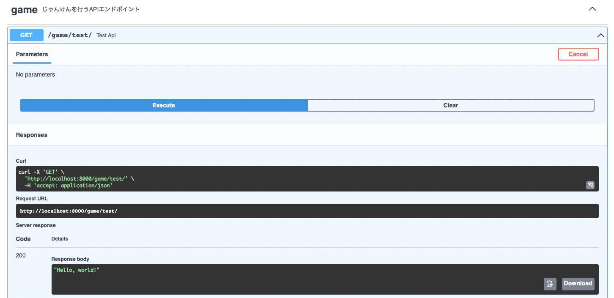
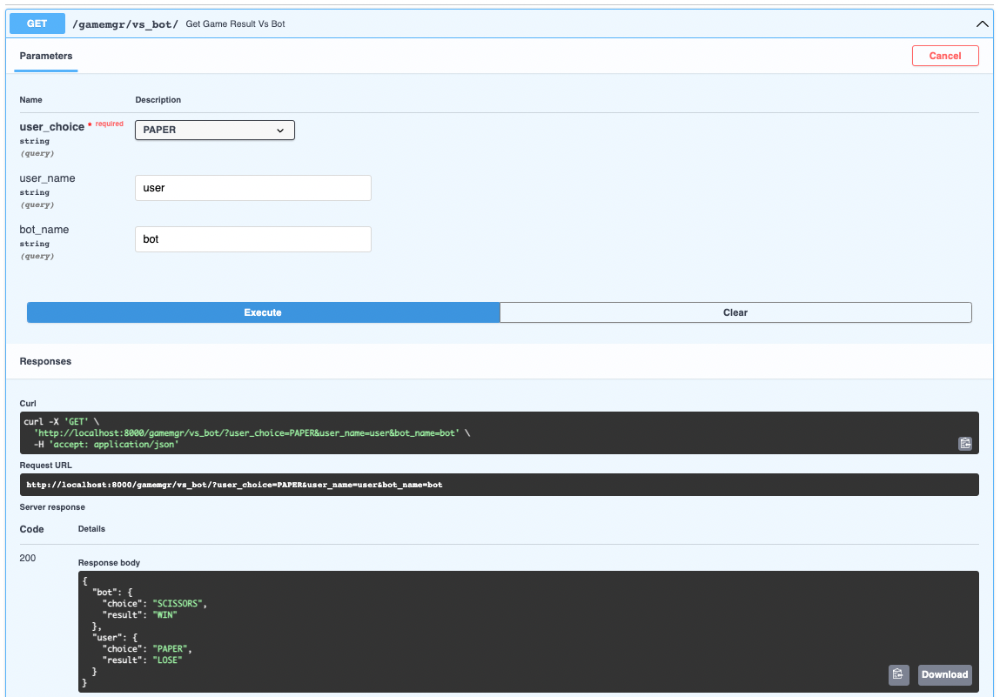

# 本講座向けの環境構築

> * Python 3.9.4
> * Node 17.2.0
> * Yarn
> * Docker (Dockerに慣れていない方はDocker for Desktopも)
> * Cloudflaredコマンド

---

# この講座の目標

* FastAPIを使ってBotとじゃんけんができるAPIエンドポイントを作成
* Reactを使ってユーザーとAPIをつなぐ
* 勝敗履歴をデータベースに保存できるようにする
* NGINXとCloudFlare Argo Tunnelを使ってデプロイしてみる
* [発展] WebSocketを使ってリアルタイムに複数人でじゃんけんをする
* [発展] WebSocketを使ってリアルタイムに勝敗データを取得する

---

# まずはじゃんけんをPythonで実装しよう

##### の前に、環境構築からですね

---

# Python環境構築

Python 3.9.4を使用します。

Pyenv + Pipenv等で環境構築してください。

必要なライブラリ: 現時点では特になし

(ここではPyenv + Poetryで環境構築します)

---

# Python環境構築

```bash
mkdir ddos_rcp && cd $_
mkdir api && cd $_

pyenv local 3.9.4
poetry init --python ">=3.9,<3.11" --name ddos_rcp_api --author "Kyosuke Miyamura <ask@386.jp>" -n
poetry env use 3.9.4
poetry install
```

---

# じゃんけん勝敗判定関数を作る

```python

def get_rcp_result(user_1: str, user_2: str) -> str:
    if user_1 == user_2:
        return "DRAW"
    elif user_1 == "ROCK":
        if user_2 == "SCISSORS":
            return "user_1 WIN"
        elif user_2 == "PAPER":
            return "user_2 WIN"
    elif user_1 == "SCISSORS":
        if user_2 == "ROCK":
            return "user_2 WIN"
        elif user_2 == "PAPER":
            return "user_1 WIN"
    elif user_1 == "PAPER":
        if user_2 == "ROCK":
            return "user_1 WIN"
        elif user_2 == "SCISSORS":
            return "user_2 WIN"
    return "DRAW"

if __name__ == "__main__":
    print(get_rcp_result("ROCK", "SCISSORS"))
```

---

# じゃんけん勝敗判定関数を作る

##### 長い...

---

# 汎用的なじゃんけん勝敗判定関数を作る
##### まずはじゃんけんに使用するenumを定義する

---

# enumとは

enum (列挙型)とは、

> 予め決められた複数の選択肢から値を指定する際に使用される型のこと

である。

---

# 汎用的なじゃんけん勝敗判定関数を作る
## まずはじゃんけんに使用するenumを定義する

```python
from enum import Enum

class RcpChoices(str, Enum):
    ROCK = "ROCK"
    SCISSORS = "SCISSORS"
    PAPER = "PAPER"

class RcpResults(str, Enum):
    WIN = "WIN"
    LOSE = "LOSE"
    DRAW = "DRAW"
```

---

# 汎用的なじゃんけん勝敗判定関数を作る
## 関数を定義する

```python
def get_rcp_result(in_: dict[str, RcpChoices]) -> dict[str, RcpResults]:
    """じゃんけんの勝敗判定を行う関数

    Args:
        in_ (dict[str, RcpChoices]): ユーザーと出した手を格納した辞書

    Returns:
        dict[str, RcpResults]: ユーザーと勝敗を格納した辞書
    """
```

---

# 汎用的なじゃんけん勝敗判定関数を作る
## あいこの処理を先にする

```python
from collections import Counter
```

中略

```python
def get_rcp_result(in_: dict[str, RcpChoices]) -> dict[str, RcpResults]:
    unique_results = list(Counter(in_.values()))
    if len(unique_results) != 2:
        return {n: RcpResults.DRAW for n, _ in in_.items()}
```

`unique_results`に出された手のユニークな値を格納。`unique_results`の配列の長さが2以外だとあいこが発生している。

---

# 汎用的なじゃんけん勝敗判定関数を作る
## 勝敗判定を行う

```python
if RcpChoices.ROCK in unique_results:
    if RcpChoices.SCISSORS in unique_results:
        return {n: RcpResults.WIN if r == RcpChoices.ROCK else RcpResults.LOSE for n, r in in_.items()}
    elif RcpChoices.PAPER in unique_results:
        return {n: RcpResults.WIN if r == RcpChoices.PAPER else RcpResults.LOSE for n, r in in_.items()}
return {n: RcpResults.WIN if r == RcpChoices.SCISSORS else RcpResults.LOSE for n, r in in_.items()}
```

長ったらしく書かなくても、

> * **グー** vs **チョキ**
> * **グー** vs **パー**
> * **チョキ** vs **パー**

の3つの場合のif文だけ書いておけばlistから処理しているので、臨機応変に前後を入れ替えて勝敗判定ができる

---

# 汎用的なじゃんけん勝敗判定関数を作る
## デバッグしてみよう

```python
if __name__ == "__main__":
    print(get_rcp_result({
        "1": RcpChoices.ROCK,
        "2": RcpChoices.SCISSORS,
        "3": RcpChoices.ROCK
    }))
```

```bash
poetry run python test.py
{'1': <RcpResults.WIN: 'WIN'>, '2': <RcpResults.LOSE: 'LOSE'>, '3': <RcpResults.WIN: 'WIN'>}
```

---

##### じゃんけんできた!!

---

# 汎用的なじゃんけん勝敗判定関数をAPI化する

PythonのコードをAPI化するためのライブラリ

* Django
* Django REST Framework
* Flask
* FastAPI

---

# なぜFastAPIを選ぶのか[^1]

* Djangoはそもそも大規模開発向き - 今回は小規模なので除外
* FastAPIはFlaskと比べて:
  * 自動でSwaggerを標準で生成してくれる
  * ORMツールとの相性がいい
  * 動作速度がかなり早い

[^1]: https://qiita.com/bee2/items/0ad260ab9835a2087dae

---

# FastAPIのセットアップ

FastAPIと関連ツール (サーバーライブラリ)をインストール

```bash
poetry add fastapi gunicorn 'uvicorn[standard]'
```

ついでに環境変数を管理しやすくするライブラリ、`python-dotenv`をインストール

```bash
poetry add python-dotenv
```

---

# `python-dotenv`の役割

通常、環境変数は`export`コマンドなどでシステムに直接紐付けなければいけないが、`python-dotenv`を使うことで、`.env`ファイルで環境変数をかんたんに管理することができる。

複数のプロジェクトを同時に開発している場合など、`.env`で環境変数が管理できるようになると便利。

環境変数には、データベースの接続情報などを格納する

---

# FastAPIを使ってAPI化

FastAPIプロジェクトのディレクトリ構造

```bash
├── README.md
├── app
│   ├── controllers
│   │   └── rcp
│   │       ├── __init__.py
│   │       └── game_controller.py
│   ├── env.py
│   ├── main.py
│   └── routers
│       ├── __init__.py
│       └── gamemgr.py
├── poetry.lock
├── pyproject.toml
└── run.py


```

appの中にソースコードがすべて入っており、APIエンドポイントごとの処理内容はroutersフォルダに、いろんな処理 (じゃんけん勝敗判定など)はcontrollersの中に格納

---

# FastAPIを使ってAPI化

`app/main.py`

```python
import os
import logging
from dotenv import load_dotenv
from fastapi import FastAPI
from fastapi.middleware.cors import CORSMiddleware
from app.routers import router
import app.env as env

# Load environment variables
load_dotenv()

tags_metadata = [
    {
        "name": "gamemgr",
        "description": "じゃんけんを行うAPIエンドポイント",
    },
]


```

続く

---

# FastAPIを使ってAPI化

`app/main.py` (続き)

```python
app = FastAPI(
    title = "ddos_rcp",
    description = "RCP API Demo for DDoS 2022",
    version = env.API_VERSION,
    openapi_tags=tags_metadata,
    root_path = "/" if os.getenv("DEV_MODE", 'False') == 'True' else "/api",
    openapi_url = '/openapi.json' if os.getenv("DEV_MODE", 'False') == 'True' else None,
    debug = True if os.getenv("DEV_MODE", 'False') == 'True' else False,
    )

origins = [
    "*",
]
app.add_middleware(
    CORSMiddleware,
    allow_origins = ["*"] if os.getenv("DEV_MODE", 'False') == 'True' else origins,
    allow_credentials = True,
    allow_methods = ["*"],
    allow_headers = ["*"],
)

app.include_router(router)


```

---

# FastAPIを使ってAPI化

FastAPIサーバーの設定

プロジェクト名やアプリのバージョンなどを定義できる

---

# FastAPIを使ってAPI化

`app/env.py`

```python
API_VERSION = '0.0.1'
```

---

# FastAPIを使ってAPI化

`app/routers/__init__.py`

```python
# Import Libraries
from fastapi import APIRouter

# FastAPI settings
router = APIRouter()

# Import routes

from app.routers import gamemgr
router.include_router(gamemgr.router, prefix="/gamemgr", tags=["gamemgr"],)
```

---

# FastAPIを使ってAPI化

`app/routers/gamemgr.py`

```python
from fastapi import APIRouter

router = APIRouter()

@router.get("/test/", response_model=str)
def test_api() -> str:
    return "Hello, world!"
```

---

# FastAPIを使ってAPI化

できた!



---

# FastAPIを使ってAPI化

勝敗判定の関数とか色々を`app/controllers/rcp/game_controller.py`に移動させる

`get_rcp_result`関数の処理の一番最初に

```python
if len(in_) <= 1:
    raise ValueError("in_ must have at least 2 items.")
```

を入れてエラーを防ぐ

```python
import random

def get_bot_choice() -> RcpChoices:
    return random.choice(list(RcpChoices))
```

ランダムに手を発生させる (botの手)関数を作成する

---

# FastAPIを使ってAPI化

簡単に先程作った関数を読み込めるようにする

`app/controllers/rcp/__init__.py`

```python
from app.controllers.rcp import game_controller
```

---

# FastAPIを使ってAPI化

`app/routers/gamemgr.py`

```python
from fastapi import APIRouter
from pydantic import BaseModel
import app.controllers.rcp.game_controller as rcp_controller

router = APIRouter()

class RcpResult(BaseModel):
    choice: rcp_controller.RcpChoices
    result: rcp_controller.RcpResults

@router.get("/vs_bot/", response_model=dict[str, RcpResult])
def get_game_result_vs_bot(user_choice: crud.result.RcpChoices, user_name: str = "user", bot_name: str = "bot") -> dict[str, RcpResult]:
    choice = {bot_name: rcp_controller.get_bot_choice(), user_name: user_choice}
    result = rcp_controller.get_rcp_result(choice)
    return {n: RcpResult(choice = choice[n], result = result[n]) for n in choice.keys()}
```

先程作った勝敗判定の関数を使って1人のユーザー対botでじゃんけんができるAPIエンドポイントを作成。Pydanticを使っていい感じの出力にする。

---

# FastAPIを使ってAPI化



Swaggerも自動生成されている

---

# API経由で対botのじゃんけんができるようになった

次はユーザーが実際に使えるWebサイトを作る

→ Reactを使う

---

# Reactとは

Reactとは、

> Facebookが開発したJavaScriptライブラリで、Webサイト上のUIをパーツごとに構築していくライブラリのこと

である。

---

# React + Typescript

Typescriptとは、

> JavaScriptを拡張して作られたプログラミング言語で、静的型付けができるもの

である。

今回はReact + Typescriptの構成でアプリを作ってみます。

(ちなみに386も初心者なのでコードは汚いです)

---

# まずReact + Typescriptプロジェクトを作成する

```bash
yarn create react-app my-app --template typescript
```

一緒にbootstrapも入れておく

```bash
yarn add bootstrap @types/bootstrap
yarn add node-sass @types/node-sass
yarn add react-bootstrap @types/react-bootstrap
```

---

# Bootstrapの設定

`index.tsx`にbootstrapのcssを追加

```typescript
import 'bootstrap/dist/css/bootstrap.min.css';
```

---

# Bootstrap 101

`app.tsx`にボタンを試しに追加

```typescript
import { Button } from 'react-bootstrap';
```

中略

```typescript
<Button variant="primary">青いボタン</Button>
```

---

# BootstrapでUIを作る

```typescript
import React, { useEffect, useState } from "react";
import { Navbar, Nav, Container, Row, Button, Alert } from "react-bootstrap";
import LOGO from "./logo.svg";

interface RcpChoiceDict {
  [choice: string]: string;
}

const RcpChoices = {
  ROCK: "👊",
  SCISSORS: "✌️",
  PAPER: "🖐",
} as RcpChoiceDict;

function App() {
	return (
		<div>
			<Navbar collapseOnSelect expand="lg" bg="dark" variant="dark">
				<Navbar.Brand href="#home">
					
					ddos_rcp
				</Navbar.Brand>
				<Navbar.Toggle aria-controls="responsive-navbar-nav" />
				<Navbar.Collapse id="responsive-navbar-nav">
					<Nav className="mr-auto">
						<Nav.Link href="/">Home</Nav.Link>
					</Nav>
				</Navbar.Collapse>
			</Navbar>


```

---

# BootstrapでUIを作る (続き)

```typescript
			<Container>
				<Row className="mx-0">
					{["ROCK", "SCISSORS", "PAPER"].map((v) => (
						<Button variant="primary" key={v}>
							{RcpChoices[v]}
						</Button>
					))}
				</Row>
			</Container>
            <Container>
                <Alert variant="danger">
                    <Alert.Heading>"YOU WIN"</Alert.Heading>
                    <p>Bot: 👊</p>
                    <p>You: 👊</p>
                </Alert>
            </Container>
		</div>
	);
}

export default App;


```

---

# Reactを動かしてみる

```bash
yarn start
```

---

# AxiosでAPIとやり取りする

まずはyarnでインストール

```bash
yarn add axios
```

UseStateとaxiosを入れておく (UseStateはデータの一時保管用)

```typescript
import React, { useEffect, useState } from "react";
import axios from "axios";
```

---

# AxiosでAPIとやり取りする

APIのレスポンスの内容に応じて型を定義しておく

```typescript
interface RcpResult {
	choice: string;
	result: string;
};

interface ApiResult {
	[name: string]: RcpResult;
}
```

---

# アプリを見やすくするために文字と絵文字を変換

```typescript
interface RcpChoiceDict {
	[name: string]: string;
}

const RcpChoices = {
	ROCK: "👊",
	SCISSORS: "✌️",
	PAPER: "🖐",
} as RcpChoiceDict;
```

---

# AxiosでAPIとやり取りする

App関数の中にuseStateを設置。データの取得用関数も定義しておく

```typescript
const [rcpData, setRcpData] = useState<ApiResult>();
const getRcpResult = (v: string) => {
    const urlAPI = process.env.REACT_APP_API_HOST_NAME + "/gamemgr/vs_bot/?user_choice=" + v;
    axios.get(urlAPI).then((res) => {
        setRcpData(res.data);
    });
};
```

環境変数にURLをセットしておく

`.env`

```env
REACT_APP_API_HOST_NAME=http://localhost:8000
```

---

# AxiosでAPIとやり取りする

選択肢のUI部分で先ほど作成した`getRcpResult`関数をクリック時に叩くようにする

```typescript
{["ROCK", "SCISSORS", "PAPER"].map((v) => (
    <Button variant="primary" onClick={() => getRcpResult(v)} key={v}>
        {RcpChoices[v]}
    </Button>
))}
```

---

# AxiosでAPIとやり取りする

勝敗に応じて結果を出すUIを作成 (先程作成したプロンプトを加工)

```typescript
{rcpData ? (
    <Container>
        <Alert variant={rcpData.user.result == "WIN" ? "success" : "danger"}>
            <Alert.Heading>{"YOU " + rcpData.user.result}</Alert.Heading>
            <p>Bot: {RcpChoices[rcpData.bot.choice]}</p>
            <p>You: {RcpChoices[rcpData.user.choice]}</p>
        </Alert>
    </Container>
) : null}
```

---

# Dockerで環境を立ち上げてみる

ここまで、ローカルの開発環境で開発を行ってきましたが、Dockerでも同じ環境を立ち上げることができる

の前に...

---

# Pythonライブラリをrequirements.txtに出力しておく

```bash
poetry export -f requirements.txt --output requirements.txt
```

---

# サーバー (Python)側のDockerfileを書いてみる

```dockerfile
FROM python:3.9.4-slim

WORKDIR /

COPY ./app /app
COPY ./db-migration /db-migration
COPY ./pytest.ini /pytest.ini
COPY ./alembic.ini /alembic.ini
COPY ./requirements.txt /requirements.txt

RUN apt-get update && \
    apt-get install -y \
        build-essential \
        python3-dev \
        python3-setuptools \
        make \
        gcc

RUN python3 -m pip install -r requirements.txt

RUN apt-get remove -y --purge make gcc build-essential && \
    apt-get autoremove -y && \
    rm -rf /var/lib/apt/lists/*

RUN echo $TZ > /etc/timezone

CMD [ "/usr/local/bin/gunicorn", "--worker-tmp-dir", "/dev/shm", "-k", "uvicorn.workers.UvicornWorker", "app.main:app", "--reload", "--bind", "0.0.0.0:8000" ]

EXPOSE 8000
```

---

# フロントエンド (React)側のDockerfileを書いてみる

```dockerfile
FROM node:17.2.0

WORKDIR /

COPY ./public /public
COPY ./src /src
COPY ./package.json /package.json
COPY ./tsconfig.json /tsconfig.json
COPY ./yarn.lock /yarn.lock

RUN yarn install

CMD [ "yarn", "start" ]

EXPOSE 3000
```

---

# 忘れないうちにReactの環境変数にAPI URLをセットしておく

`.env`

```env
REACT_APP_API_HOST_NAME=http://localhost:8000
```

---

# docker-compose.ymlを書いてみる

```docker-compose
version: "3.8"

services:
  api:
    build: api/.
    expose:
      - 8000
    ports:
    - 8000:8000
    restart: always
    environment:
      DEV_MODE: ${DEV_MODE}
      TZ: ${TZ}

  frontend:
    build: frontend/.
    expose:
      - 3000
    ports:
    - 3000:3000
    restart: always
    depends_on:
      - api


```

---

# PythonとReactのdocker stackを立ち上げてみよう

```bash
docker-compose up -d
```

できたことを確認したら

```bash
docker-compose down
```

---

# データベースに勝敗履歴を溜めてみよう

PostgreSQLを使おう

# TODO: SQL講座

---

# ローカル環境にDBを作成

```sql
CREATE DATABASE ddos_rcp;
CREATE USER ddos_u with encrypted password 'hogefuga';
GRANT ALL ON DATABASE ddos_rcp TO ddos_u;
```

プロジェクトごとにDBを変えるのはもちろん、ユーザーもできれば変えたほうがいい

---

# じゃんけんの履歴を保存するテーブルを作ってみよう

**`game`**
> * `id`: `serial` (`int`), `primary_key`

**`result`**
> * `id`: `serial` (`int`), `primary_key`
> * `game_id`: `int`
> * `choice`: `string`
> * `result`: `string`
> * `is_bot`: `boolean`, default: `false`

---

# ORMを使う

ORMとは、SQL文を自動生成してくれるツール

今回はFastAPIと相性のいいSQLModelを使いますが、他にもSQLAlchemyなどがある。

```bash
poetry add sqlmodel alembic psycopg2-binary
```

---

# まずはgameテーブルを作成 (`app/models/game.py`)

```python
from typing import TYPE_CHECKING, Optional, List
from enum import Enum
from datetime import datetime

from sqlmodel import Field, Relationship, SQLModel
if TYPE_CHECKING:
    from app.models import Result

class GameBase(SQLModel):
    room_id: Optional[int] = Field(nullable=True)

class Game(GameBase, table=True):
    id: Optional[int] = Field(primary_key=True, nullable=False)
    created_at: Optional[datetime] = Field(default_factory=datetime.now)
    updated_at: Optional[datetime] = Field(default_factory=datetime.now)
    results: Optional[List["Result"]] = Relationship(back_populates="game")

class GameCreate(GameBase):
    pass

class GameRead(GameBase):
    id: int
    created_at: datetime
    updated_at: datetime

class GameUpdate(SQLModel):
    pass


```

---

# 次にresultテーブル (`app/models/result.py`)

```python
from typing import Optional
from enum import Enum
from datetime import datetime

from sqlmodel import Field, Relationship, SQLModel
from app.models import Game

class RcpChoices(str, Enum):
    ROCK = "ROCK"
    SCISSORS = "SCISSORS"
    PAPER = "PAPER"

class RcpResults(str, Enum):
    WIN = "WIN"
    LOSE = "LOSE"
    DRAW = "DRAW"

class ResultBase(SQLModel):
    game_id: int = Field(default=None, foreign_key="game.id")
    choice: RcpChoices
    result: RcpResults
    is_bot: bool = Field(default=False)

class Result(ResultBase, table=True):
    id: Optional[int] = Field(primary_key=True, nullable=False)
    created_at: Optional[datetime] = Field(default_factory=datetime.now)
    updated_at: Optional[datetime] = Field(default_factory=datetime.now)
    game: Optional[Game] = Relationship(back_populates="results")

class ResultCreate(ResultBase):
    pass

class ResultRead(ResultBase):
    id: int
    created_at: datetime
    updated_at: datetime

class ResultUpdate(SQLModel):
    game_id: Optional[int] = None
    choice: Optional[RcpChoices] = None
    result: Optional[RcpResults] = None
    is_bot: Optional[bool] = None


```

---

# Circular Importを防止

Circular Importを防止するために`app/controllers/rcp/game_controller.py`で定義したenumをmodelsの方に移行して、元あったほうは`app/models/result.py`から持ってくるようにする

```python
from app.controllers import crud
```

呼び出すときは、`RcpChoices`、`RcpResults`ではなく、それぞれ`crud.result.RcpChoices`、`crud.result.RcpResults`で呼び出す。

---

# DBの設定を書いておく

`app/models/__init__.py`

```python
import os
from dotenv import load_dotenv
from sqlmodel import create_engine, Session

from app.models.game import Game, GameCreate, GameRead, GameUpdate
from app.models.result import Result, ResultCreate, ResultRead, ResultUpdate, RcpChoices, RcpResults

# Load environment variables
load_dotenv()

# MariaDBを使ってるけど、MySQLのURLにしてSQLModelを騙す
DATABASE_URL = 'postgresql://' +  str(os.environ.get('DB_USER')) + ':' + str(os.environ.get('DB_PW')) + '@' + str(os.environ.get('DB_HOST')) + ':' + str(os.environ.get('DB_PORT')) + '/' + str(os.environ.get('DB_NAME'))

engine = create_engine(DATABASE_URL, echo=True if os.getenv("DEV_MODE", 'False') == 'True' else False)

session = Session(engine)
```

---

# crud用の関数を書く

`create`、`read`、`update`、`delete`用の関数を定義して、かんたんに呼び出せるようにする

今回使わないものもありますが、練習として一応全部crud載せておきます

まずgameテーブルから

---

# crud用の関数を書く

`app/controllers/crud/game.py`

```python
from typing import List
from datetime import datetime
from fastapi import HTTPException
from app.models import session, Game, GameCreate, GameRead, GameUpdate

from sqlmodel import select

def create_game(game: GameCreate) -> GameRead:
    game_remapped = Game.from_orm(game)
    session.add(game_remapped)
    try:
        session.commit()
    except:
        session.rollback()
        raise HTTPException(status_code=500, detail="Internal Server Error")
    else:
        session.refresh(game_remapped)
        return GameRead.from_orm(game_remapped)

def get_games(skip: int = 0, limit: int = 100) -> List[GameRead]:
    games = session.exec(select(Game).order_by(Game.id).offset(skip).limit(limit)).all()
    if len(games) == 0:
        raise HTTPException(status_code=404, detail="Game not found")
    return [GameRead.from_orm(game) for game in games]


```

---

# crud用の関数を書く

```python
def get_game(game_id: int) -> GameRead:
    game = session.get(Game, game_id)
    if game:
        game = GameRead.from_orm(game)
        return game
    else:
        raise HTTPException(status_code=404, detail="Game not found")

def update_game(game_id: int, game: GameUpdate) -> GameRead:
    db_game = session.get(Game, game_id)
    if not db_game:
        raise HTTPException(status_code=404, detail="Game not found")
    game_data = game.dict(exclude_unset=True)
    for key, value in game_data.items():
        if value is not None:
            setattr(db_game, key, value)
    setattr(db_game, "updated_at", datetime.now())
    session.add(db_game)
    session.commit()
    session.refresh(db_game)
    db_game = GameRead.from_orm(db_game)
    return db_game

def delete_game(game_id: int) -> bool:
    game = session.get(Game, game_id)
    if not game:
        raise HTTPException(status_code=404, detail="Game not found")
    session.delete(game)
    session.commit()
    return True


```

---

# crud用の関数を書く

同じく、resultテーブルのも。 (`app/controllers/crud/result.py`)

```python
from typing import List
from datetime import datetime
from fastapi import HTTPException
from app.models import session, Result, ResultCreate, ResultRead, ResultUpdate, RcpChoices, RcpResults

from sqlmodel import select

def create_result(result: ResultCreate) -> ResultRead:
    result_remapped = Result.from_orm(result)
    session.add(result_remapped)
    try:
        session.commit()
    except:
        session.rollback()
        raise HTTPException(status_code=500, detail="Internal Server Error")
    else:
        session.refresh(result_remapped)
        return ResultRead.from_orm(result_remapped)

def get_results(skip: int = 0, limit: int = 100) -> List[ResultRead]:
    results = session.exec(select(Result).order_by(Result.id).offset(skip).limit(limit)).all()
    if len(results) == 0:
        raise HTTPException(status_code=404, detail="Result not found")
    return [ResultRead.from_orm(result) for result in results]


```

---

# crud用の関数を書く

```python
def get_result(result_id: int) -> ResultRead:
    result = session.get(Result, result_id)
    if result:
        result = ResultRead.from_orm(result)
        return result
    else:
        raise HTTPException(status_code=404, detail="Result not found")

def update_result(result_id: int, result: ResultUpdate) -> ResultRead:
    db_result = session.get(Result, result_id)
    if not db_result:
        raise HTTPException(status_code=404, detail="Result not found")
    result_data = result.dict(exclude_unset=True)
    for key, value in result_data.items():
        if value is not None:
            setattr(db_result, key, value)
    setattr(db_result, "updated_at", datetime.now())
    session.add(db_result)
    session.commit()
    session.refresh(db_result)
    db_result = ResultRead.from_orm(db_result)
    return db_result

def delete_result(result_id: int) -> bool:
    result = session.get(Result, result_id)
    if not result:
        raise HTTPException(status_code=404, detail="Result not found")
    session.delete(result)
    session.commit()
    return True


```

---

# かんたんにcurd関数を呼び出せるようにする

`app/controllers/crud/__init__.py`

```python
from app.controllers.crud import game, result
```

---

# APIからcrud関数を直接叩けるようにしておく

`app/routers/game.py`

```python
from typing import List
from fastapi import APIRouter

import app.controllers.crud as crud

router = APIRouter()

@router.post("/", response_model=crud.game.GameRead)
def create_game(game: crud.game.GameCreate) -> crud.game.GameRead:
    game_obj = crud.game.create_game(game)
    return crud.game.GameRead.from_orm(game_obj)

@router.get("/", response_model=List[crud.game.GameRead])
def get_games(skip: int=0, limit: int=100) -> List[crud.game.GameRead]:
    game_obj = crud.game.get_games(skip=skip, limit=limit)
    return game_obj

@router.get("/{game_id}", response_model=crud.game.GameRead)
def get_game(game_id: int) -> crud.game.GameRead:
    game_obj = crud.game.get_game(game_id=game_id)
    return game_obj

@router.patch("/{game_id}", response_model=crud.game.GameRead)
def update_game(game_id: int, game: crud.game.GameUpdate) -> crud.game.GameRead:
    game_obj = crud.game.update_game(game_id=game_id, game=game)
    return game_obj

@router.delete("/{game_id}")
def delete_game(game_id: int) -> dict:
    crud.game.delete_game(game_id=game_id)
    return {"status": "success"}


```

---

# APIからcrud関数を直接叩けるようにしておく

resultテーブルも同じく (`app/routers/result.py`)

```python
from typing import List
from fastapi import APIRouter

import app.controllers.crud as crud

router = APIRouter()

@router.post("/", response_model=crud.result.ResultRead)
def create_result(result: crud.result.ResultCreate) -> crud.result.ResultRead:
    result_obj = crud.result.create_result(result)
    return crud.result.ResultRead.from_orm(result_obj)

@router.get("/", response_model=List[crud.result.ResultRead])
def get_results(skip: int=0, limit: int=100) -> List[crud.result.ResultRead]:
    result_obj = crud.result.get_results(skip=skip, limit=limit)
    return result_obj

@router.get("/{result_id}", response_model=crud.result.ResultRead)
def get_result(result_id: int) -> crud.result.ResultRead:
    result_obj = crud.result.get_result(result_id=result_id)
    return result_obj

@router.patch("/{result_id}", response_model=crud.result.ResultRead)
def update_result(result_id: int, result: crud.result.ResultUpdate) -> crud.result.ResultRead:
    result_obj = crud.result.update_result(result_id=result_id, result=result)
    return result_obj

@router.delete("/{result_id}")
def delete_result(result_id: int) -> dict:
    crud.result.delete_result(result_id=result_id)
    return {"status": "success"}


```

---

# APIからcrud関数を直接叩けるようにしておく

routersに読み込ませておく

`app/routers/__init__.py`

```python
from app.routers import game
router.include_router(game.router, prefix="/game", tags=["game"],)

from app.routers import result
router.include_router(result.router, prefix="/result", tags=["result"],)
```

---

# 先程作ったcurd関数を使って、結果を保存する関数を作る

`app/controllers/rcp/game_controller.py`

```python
def save_rcp_result(in_: dict[str, crud.result.RcpChoices], out_: dict[str, crud.result.RcpResults]) -> None:
    """結果を保存する関数

    Args:
        in_ (dict[str, crud.result.RcpResults]): ユーザーと勝敗を格納した辞書
    """
    game = crud.game.create_game(crud.game.GameCreate())
    for (n, c), (_, r) in zip(in_.items(), out_.items()):
        crud.result.create_result(crud.result.ResultCreate(
            game_id = game.id,
            choice = c,
            result = r,
            is_bot = True if n == "bot" else False
        ))
```

---

# 対botのAPIを叩いたときにデータが保存されるようにする

`app/routers/gamemgr.py`

```python
@router.get("/vs_bot/", response_model=dict[str, RcpResult])
def get_game_result_vs_bot(user_choice: crud.result.RcpChoices, user_name: str = "user", bot_name: str = "bot") -> dict[str, RcpResult]:
    choice = {bot_name: rcp_controller.get_bot_choice(), user_name: user_choice}
    result = rcp_controller.get_rcp_result(choice)
    rcp_controller.save_rcp_result(choice, result)
    return {n: RcpResult(choice = choice[n], result = result[n]) for n in choice.keys()}
```

---

# FastAPIを立ち上げる前に、マイグレーション

ORMで書いたテーブルのモデルを実際のデータベースに適用させる作業のことをマイグレーションと呼ぶ

今回はalembicを使ってマイグレーションを行う

```bash
alembic revision -m "init" --autogenerate
alembic upgrade head
```

---

# 実際にローカル環境で試してみる


---

# 1ホストでAPIとフロントエンドを運用

NGINXのプロキシを噛ませてあげることで、

> * `/`はフロントエンド
> * `/api/`はAPIサーバー

というルーティングができるようになる

---

# 1ホストでAPIとフロントエンドを運用

```bash
mkdir lb
```

---

# 1ホストでAPIとフロントエンドを運用

`lb/default.conf`

```nginx
upstream rcp-api {
    server api:8000;
}
upstream rcp-frontend {
    server frontend:3000;
}

server {
    listen 80;

    location /api/ {
        proxy_pass http://rcp-api/;
    }

    location / {
        proxy_pass http://rcp-frontend/;
    }
}


```

---

# の前に、docker環境で動作させるので、DBもdockerに置く

```dockerfile
services:
  db:
    image: postgres:13-alpine
    volumes:
      - postgres:/var/lib/postgresql/data
    expose:
      - 5432
    restart: always
    environment:
      POSTGRES_DB: ${DB_NAME}
      POSTGRES_USER: ${DB_USER}
      POSTGRES_PASSWORD: ${DB_PW}
      TZ: ${TZ}

volumes:
  postgres:
```

---

# の前に、docker環境で動作させるので、DBもdockerに置く

APIの方もdepends_onを変えておく

```dockerfile
services:
  api:
    depends_on:
      - db
```

---

# dockerのDBもマイグレーション

```bash
docker-compose up -d --build
docker exec -it ddos_rcp-api-1 bash
alembic upgrade head
```

---

# CloudFlare Argo Tunnelを使って公開する

```bash
cloudflared tunnel --url localhost:8000
```

---

##### はってーーーん！！

---

# WebSocketとは

非同期に通信できる通信プロトコル

一回通信が確立すれば、サーバー、ユーザーどちらからでもいつでもデータを送り合うことができる

---

# WebSocketの難しいところ

* データ型がOpenAPIみたいにきちっと定義できるわけではないので、自分たちで定義して処理を書いていかないといけない
* ping / pongなどの他の通信を阻害しないように、並列処理などをうまく使わなきゃいけなかったりする場合もある
* クライアントサイドを書くのがめんどい
* 基本切れる
* めちゃくちゃステートフル

---

# WebSocketで複数人でじゃんけん

`app/routers/gamemgr.py`

```python
from starlette.websockets import WebSocket
```

中略

```python
sessions = {}
choices = {}

@router.websocket("/ws/{room_id}")
async def websocket_endpoint(ws: WebSocket, room_id: int):
    await ws.accept()
    key = ws.headers.get('sec-websocket-key')
    if room_id not in sessions:
        sessions[room_id] = {}
        choices[room_id] = {}
    sessions[room_id][key] = ws
    for client in sessions[room_id].values():
        await client.send_json({"type": "room_users", "data": len(sessions[room_id])})


```

---

# WebSocketで複数人でじゃんけん

`app/routers/gamemgr.py`

```python
try:
    while True:
        data = await ws.receive_json()
        if data['type'] == "rcp_my_choice":
            choices[room_id][key] = data['data']
            if len(sessions[room_id]) > 1:
                if len(choices[room_id]) == len(sessions[room_id]):
                    result = rcp_controller.get_rcp_result(choices[room_id])
                    rcp_controller.save_rcp_result(choices[room_id], result)
                    for client in sessions[room_id].values():
                        await client.send_json({"type": "result", "data": result})
                    choices[room_id] = {}
except:
    await ws.close()
    del sessions[room_id][key]
    if not any(sessions[room_id]):
        del sessions[room_id]


```

---

# Reactで複数人用のページを作る

まずは、対botと複数人用と別々のページにできるようにする

→ React Routerなるものを導入

```bash
yarn add react-router-dom @types/react-router-dom
```

---

# Routerを設定する

`src/index.tsx`

```typescript
import { render } from "react-dom";
import {BrowserRouter, Routes, Route} from "react-router-dom"
import './index.css';
import 'bootstrap/dist/css/bootstrap.min.css';

import App from './App';

const rootElement = document.getElementById("root");
render(
  <BrowserRouter>
    <Routes>
      <Route path="/" element={<App />} />
    </Routes>
  </BrowserRouter>,
  rootElement
);
```

---

# `App.tsx`を複製してWebSocket対応していこう

`AppWs.tsx`として複製、function名を`AppWs`にする

`index.tsx`を編集してルートを追加

```typescript
import AppWs from './AppWs';

# 中略

<Route path="/ws/:roomId" element={<AppWs />} />
```

---

# `App.tsx`を複製してWebSocket対応していこう

WebSocketを扱えるように、ライブラリを入れておく

```bash
yarn add websocket @types/websocket
```

---

# `App.tsx`を複製してWebSocket対応していこう

`index.tsx`で設定したURLパラーメーターを取得できるようにする

```typescript
import { useParams } from "react-router-dom";
```

中略

```typescript
function AppWs() {
	let { roomId } = useParams();
```

---

# `App.tsx`を複製してWebSocket対応していこう

WebSocketの準備

```typescript
const [wsId, setWsId] = useState<keyof ApiResult>("");
const WS_URL = process.env.REACT_APP_WS_API_HOST_NAME + '/gamemgr/realtime/' + roomId;
const [ws, setWs] = useState<WebSocket>();


useEffect(() => {
    setWs(new WebSocket(WS_URL));
}, []);
```

---

# `App.tsx`を複製してWebSocket対応していこう

忘れないうちに環境変数を設定

`.env`

```env
REACT_APP_WS_API_HOST_NAME=ws://localhost:8000
```

`docker-compose.yml`も

```docker-compose
environment:
    REACT_APP_API_HOST_NAME: ${REACT_APP_API_HOST_NAME}
    REACT_APP_WS_API_HOST_NAME: ${REACT_APP_WS_API_HOST_NAME}
```

---

# `App.tsx`を複製してWebSocket対応していこう

自分のIDを記録したり、結果を保存したりする

```typescript
if (ws !== undefined) {
    ws.onopen = (event) => {
        console.log('WebSocket Client Connected');
    };
    ws.onmessage = function (event) {
        console.log(event);
        const msg = JSON.parse(event.data);
        if (msg.type == "your_ws_id") {
            setWsId(msg.data);
        }
        if (msg.type == "result") {
            setRcpData(msg.data);
        }
    };
}
```

---

# `App.tsx`を複製してWebSocket対応していこう

ボタンをクリックしたときの動作もws対応にする

```typescript
const getRcpResult = (v: string) => {
    if (ws !== undefined) {
        ws.send(JSON.stringify({
            "type": "rcp_my_choice",
            "data": v
        }));
    }
};
```

---

# `App.tsx`を複製してWebSocket対応していこう

結果の表示部分も複数人対応

```typescript
{rcpData ? (
    <Container>
        <Alert variant={rcpData[wsId].result == "WIN" ? "success" : "danger"}>
        {/* <Alert variant="success"> */}
            <Alert.Heading>{"YOU " + rcpData[wsId].result}</Alert.Heading>
            {Object.entries(rcpData).map(([k,v]) => (
                <p key={k}>{k}: {RcpChoices[v.choice]}</p>
            ))}
        </Alert>
    </Container>
) : null}
```

---

# NGINXもWebSocket対応させる

ちょっとconfigを追記する必要あり

```nginx
map $http_upgrade $connection_upgrade {
    default upgrade;
    ''      close;
}

upstream rcp-api {
    server api:8000;
}
upstream rcp-frontend {
    server frontend:3000;
}

server {
    listen 80;

    proxy_http_version 1.1;
    proxy_set_header Host $host;
    proxy_set_header Upgrade $http_upgrade;
    proxy_set_header Connection $connection_upgrade;

    location /api/ {
        proxy_pass http://rcp-api/;
    }

    location / {
        proxy_pass http://rcp-frontend/;
    }
}


```

---

# CloudFlare Argo Tunnelでそのままデプロイできます

独自ドメインもCloudFlareを使っていれば使える

```bash
cloudflared login
cloudflared tunnel --url localhost:8000 --hostname hoge.386.jp
```

---

# 統計情報を表示させよう

`app/controllers/crud/result.py`に突貫工事でグー・チョキ・パーそれぞれの勝数を出す関数を作る

```python
def get_result_counts() -> dict:
    results = {k: len(session.exec(select(Result).filter(Result.result == RcpResults.WIN).filter(Result.choice == k)).all()) for k in RcpChoices.__members__.keys()}
    return results
```

---

# 統計情報を表示させよう

`app/routers/gamemgr.py`に統計情報出力用のWebSocketのAPIエンドポイントを新規作成

```python
analytics_sessions = {}

@router.websocket("/analytics/")
async def websocket_analytics_endpoint(ws: WebSocket):
    await ws.accept()
    key = ws.headers.get('sec-websocket-key')
    analytics_sessions[key] = ws
    await ws.send_json({"type": "analytics", "data": crud.result.get_result_counts()})
    try:
        while True:
            data = await ws.receive_json()
    except:
        await ws.close()
        del analytics_sessions[key]
```

---

# 統計情報を表示させよう

ゲーム本体のAPIにも細工をして、ゲームが行われたごとに統計用のwsクライアントに対してデータを送信するようにする

ゲームの結果を送信するfor文のあとに付け加える

`app/routers/gamemgr.py`

```python
for client in analytics_sessions.values():
    await client.send_json({"type": "analytics", "data": crud.result.get_result_counts()})
```

ステートフルなアプリだからこういう荒業もできる

---

# 統計情報を表示させよう

`src/AppWs.tsx`を`src/AppWsA.tsx`に複製。

`src/index.tsx`にルートを作成

```typescript
import AppWsA from './AppWsA';
```

中略

```typescript
<Route path="/wsa/" element={<AppWsA />} />
```

---

# 統計情報を表示させよう (`src/AppWsA.tsx`)

```typescript
import React, { useEffect, useState } from "react";
import { Navbar, Nav, Container, Row, Button, Alert } from "react-bootstrap";
import LOGO from "./logo.svg";

interface ApiResult {
	[name: string]: number;
}

interface WsResponseType {
	[name: string]: any;
}

interface RcpChoiceDict {
	[name: string]: string;
}

const RcpChoices = {
	ROCK: "👊",
	SCISSORS: "✌️",
	PAPER: "🖐",
} as RcpChoiceDict;


```

中略

---

# 統計情報を表示させよう (`src/AppWsA.tsx`)

```typescript
function AppWsA() {
	const [rcpAnalyticsData, setRcpAnalyticsData] = useState<ApiResult>();
	const WS_URL = process.env.REACT_APP_WS_API_HOST_NAME + '/gamemgr/analytics/';
	const [ws, setWs] = useState<WebSocket>();

	useEffect(() => {
		setWs(new WebSocket(WS_URL));
	}, []);

	if (ws !== undefined) {
		ws.onopen = (event) => {
			console.log('WebSocket Client Connected');
		};
		ws.onmessage = function (event) {
			console.log(event);
			const msg: WsResponseType = JSON.parse(event.data.toString());
			if (msg.type == "analytics") {
				setRcpAnalyticsData(msg.data);
			}
		};
	}


```

中略

---

# 統計情報を表示させよう (`src/AppWsA.tsx`)

```typescript
	return (
		<div>
			<Navbar collapseOnSelect expand="lg" bg="dark" variant="dark">
				<Navbar.Brand href="/">
					
					ddos_rcp
				</Navbar.Brand>
				<Navbar.Toggle aria-controls="responsive-navbar-nav" />
				<Navbar.Collapse id="responsive-navbar-nav">
					<Nav className="mr-auto">
						<Nav.Link href="/">API</Nav.Link>
						<Nav.Link href="/ws/1">WebSocket</Nav.Link>
						<Nav.Link href="/wsa">WebSocket_Analytics</Nav.Link>
					</Nav>
				</Navbar.Collapse>
			</Navbar>
			{rcpAnalyticsData ? (
				<Container>
					<Alert variant="success">
						<Alert.Heading>Realtime Analytics</Alert.Heading>
						{Object.entries(rcpAnalyticsData).map(([k,v]) => (
							<p key={k}>{RcpChoices[k]}: {v}</p>
						))}
					</Alert>
				</Container>
			) : null}
		</div>
	);
}

export default AppWsA;


```
