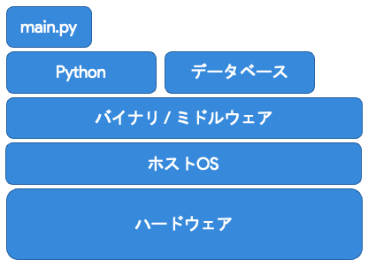
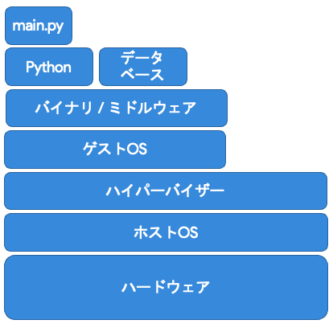
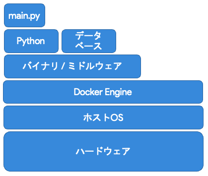
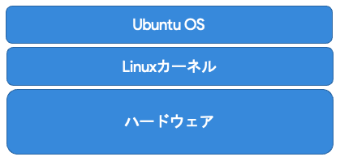

# Dockerとは

Dockerとは、

> Docker社が開発している、コンテナ型の仮想環境を作成、配布、実行するためのプラットフォーム

である。

→ 普通にローカルマシンに環境を構築するのと何が違うのか?

---

# 環境構築手法: ベアメタル



> 階層は少ないが、他のPCに移植しにくい

* 階層が少ない
    マシンの性能を最大限発揮できる
* 他のPCに移植しにくい
    サーバーなどの場合、たくさんのサーバーで同じプログラムを同じように動かすことで大量のクライアントを捌いているが、大量のサーバーに同じプログラムを同じ環境で動かすのが難しくなる

みなさんの開発環境はほとんどこれでは?

---

# 環境構築手法: VM (仮想マシン)



> 他のPCに移植しやすいが、階層が多い

* 階層が多い
    マシンの性能を仮想化などにも持っていかれるので、最大限のパフォーマンスを出しにくい (例: マシンに投資してもその80%くらいの性能しか出ない)

---

# 環境構築手法: コンテナ



> 他のPCに移植しやすいし、階層も比較的少ない

Dockerはこのコンテナに含まれる

---

# コンテナの仕組み



Linux系のOSでは、Linuxカーネルと呼ばれるものの上にそれぞれのOSの機能が載っている

→この特性を活用して、Linuxカーネルだけホスト・Docker共通で使い、Dockerコンテナ内で別のOS (ディストリビューション)のLinuxカーネルより上の階層を再現できる

---

# コンテナの仕組み


Linux系のOSでは、Linuxカーネルと呼ばれるものの上にそれぞれのOSの機能が載っている

→この特性を活用して、Linuxカーネルだけホスト・Docker共通で使い、Dockerコンテナ内で別のOS (ディストリビューション)のLinuxカーネルより上の階層を再現できる

軽量だけど、確実にアプリの実行環境を共有できる、かつ、コードに書かれた状態で環境を共有できる (Infrastructure as Code, IaCにも繋がる)

---

# [余談] Infrastructure as Codeとは

Infrastructure as Codeとは、

> コンピュータやソフトウェアの構成や設定に関する情報をプログラムコードとして記述し、専用のソフトウェアによって自動的に適用する手法

である。

最近では、Dockerなどだけでなく、AWSでどのようなサーバーを何台建てるのか、というのもコードで定義できるようになってきている

---

# Dockerの使い方


---

# Dockerを扱う上で重要な2つのファイル

* `Dockerfile`
> * コンテナの構成内容 (設計図)が書かれている
> * シェルスクリプトのような形で`apt install`などの環境構築時に必要なコマンドを書いておける
> * 基本的にDB接続情報を含む環境変数などのあとで変わる可能性のあるものは`docker-compose.yml`で設定するため、そこで変更できるように特殊な書き方をする

* `docker-compose.yml`
> * スタックの構成内容 (設計図)が書かれている
> * ポート番号や環境変数など、あとから変更する可能性のある内容を書いておく
> * 通信、ストレージなどの設定もここで行う

---

# `Dockerfile`の例

FastAPI (Python)アプリの例

```Dockerfile
# ベースイメージを選択
FROM python:3.9.4-slim

# コンテナの中のメインとなるディレクトリを指定
WORKDIR /

# ファイルをコンテナにコピー
COPY ./app /app
COPY ./db-migration /db-migration
COPY ./pytest.ini /pytest.ini
COPY ./alembic.ini /alembic.ini
COPY ./requirements.txt /requirements.txt

```

---

# `Dockerfile`の例 (続き)

FastAPI (Python)アプリの例

```Dockerfile
# 必要なライブラリをインストール
RUN apt-get update && \
    apt-get install -y \
        build-essential \
        python3-dev \
        python3-setuptools \
        make \
        gcc

RUN python3 -m pip install -r requirements.txt

# コンテナをすっきりさせるために不必要なものはアンインストール
RUN apt-get remove -y --purge make gcc build-essential && \
    apt-get autoremove -y && \
    rm -rf /var/lib/apt/lists/*

# タイムゾーンを設定
RUN echo $TZ > /etc/timezone

# アプリを実行
CMD [ "/usr/local/bin/gunicorn", "--worker-tmp-dir", "/dev/shm", "-k", "uvicorn.workers.UvicornWorker", "app.main:app", "--reload", "--bind", "0.0.0.0:8000" ]

# 公開するポートを定義
EXPOSE 8000
```

---

# `docker-compose.yml`の例

```yaml
version: "3.8"

# 使うコンテナと環境情報を設定
services:
  api:
    build: . # 先程の`Dockerfile`を元にコンテナを作成
    expose:
      - 8000
    ports:
    - 8000:8000 # 外部に公開するポート
    restart: always # アプリ (コンテナ)が死んだら自動的に再起動するようにする
    environment:
      DB_HOST: ${DB_HOST}
      DB_PORT: ${DB_PORT}
      DB_NAME: ${DB_NAME}
      DB_USER: ${DB_USER}
      DB_PW: ${DB_PW}
      TZ: ${TZ}
    depends_on:
      - db


```

---

# `docker-compose.yml`の例 (続き)

```yaml

  db:
    image: postgres:13-alpine # 既存のイメージもある
    volumes:
      - postgres:/var/lib/postgresql/data
    expose:
      - 5432
    restart: always
    environment:
      POSTGRES_DB: ${DB_NAME}
      POSTGRES_USER: ${DB_USER}
      POSTGRES_PASSWORD: ${DB_PW}
      TZ: ${TZ}

volumes:
  postgres:
```

---

# なぜコンテナを使うのか?

* 仮想マシンのような環境の複製のしやすさと、動作環境の安定さ・速度が両立している
* 環境を容易に複製できる
    * 近年流行ってるクラウド - アクセス量が多いときはサーバーを増やして、そうでないときは減らす (Kubernetes)
    * 開発者側で同じ環境を整備できる